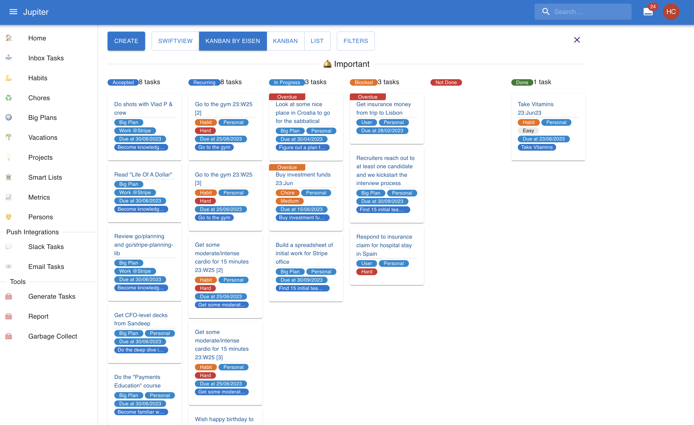
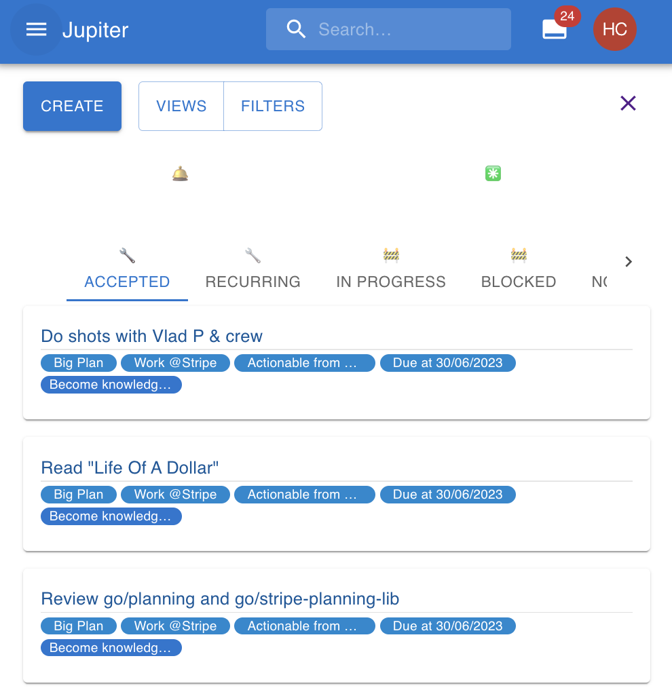
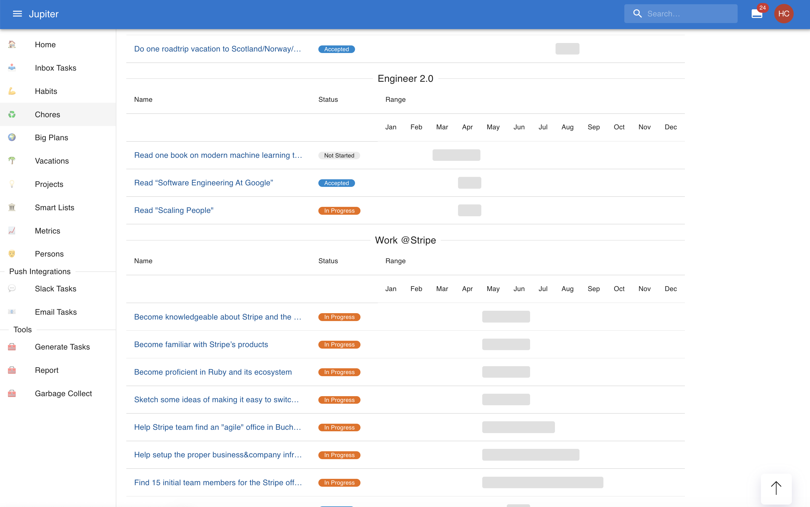

# The Thrive Goal Management System   

Thrive is a tool for _life planning_. It provides goals management, task tracking,
habit building, chores management, lists, metrics, a personal relationship manager, and
much more all in a unified package.

I built it to [solve an issue I had](http://www.paulgraham.com/organic.html) - making sure everything
I wanted to get done actually got done, while juggling the standard complexities of life - family, kids, career, etc.

The current version is both a [webapp](https://get-thriving.com) and a CLI application.

Here's a picture from the "inbox" view:

And another mobile friendly view:

And here's one for the "big plans timeline" view:

Follow the [tutorial](src/docs/tutorial.md) or go on to read the full 
[docs](https://docs.get-thriving.com/) to get a feeling for what the application can fully do!
