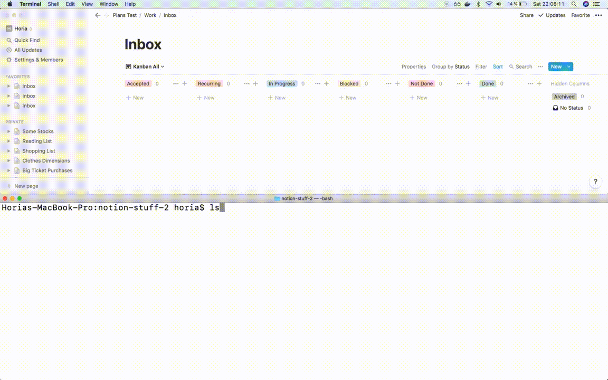

# The Jupiter Goal Management System   

Jupiter is a small tool for _life planning_, meaning goals management, task tracking,
habit building, metrics tracking, etc.

The current version adds a bunch of magic to [Notion.so](https://notion.so) - an
already existing and great productivity app which is a sort of cross between Trello,
Jira, and Confluence. The “magic” is just a bunch of conventions on how work is
organized. There is a growing set of CLI scripts for maintaining these conventions
and automating such things like recurring task creation, task archival, etc.

Here's a demo of it in action:

Follow the [tutorial](docs/tutorial.md) or go on to read the full [docs](https://jupiter-goals.readthedocs.io) to
get a feeling for what the application can fully do!
