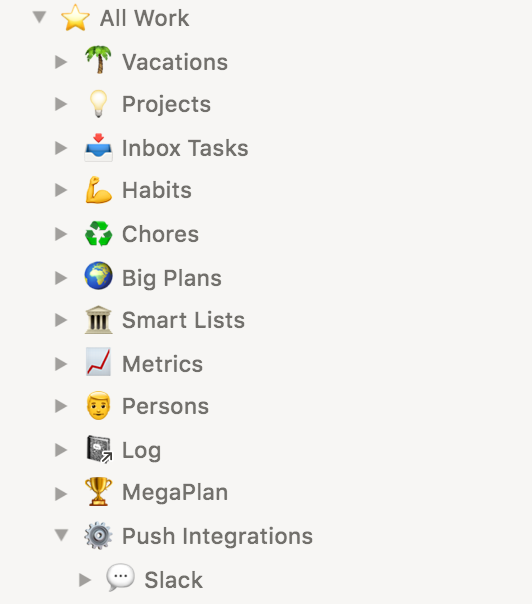
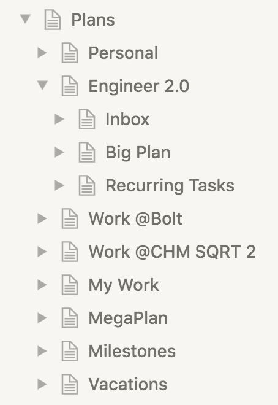
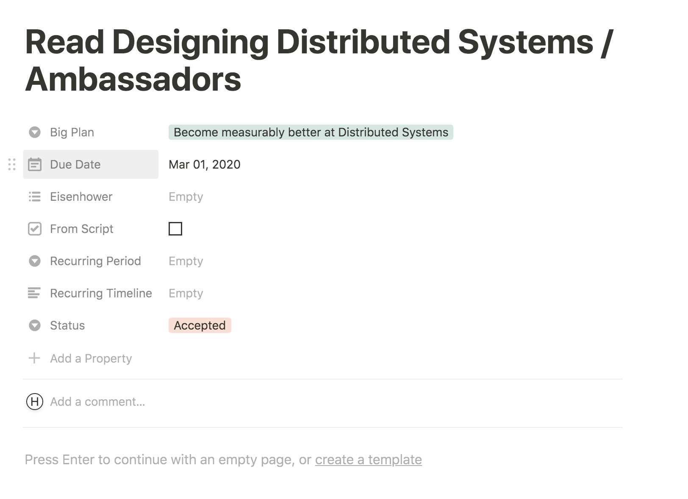
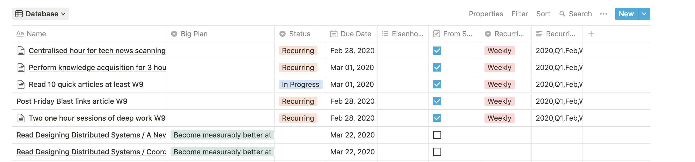
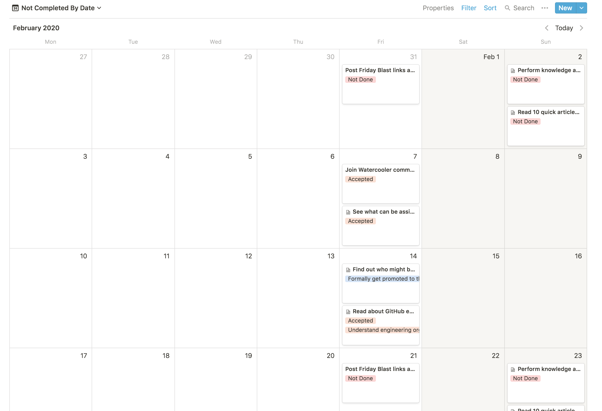
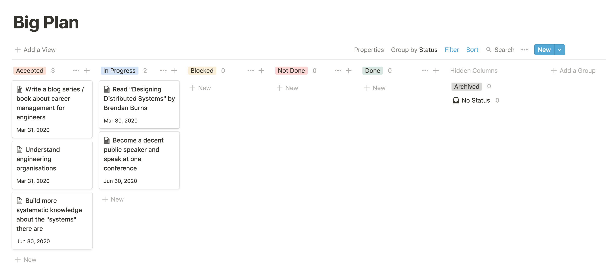
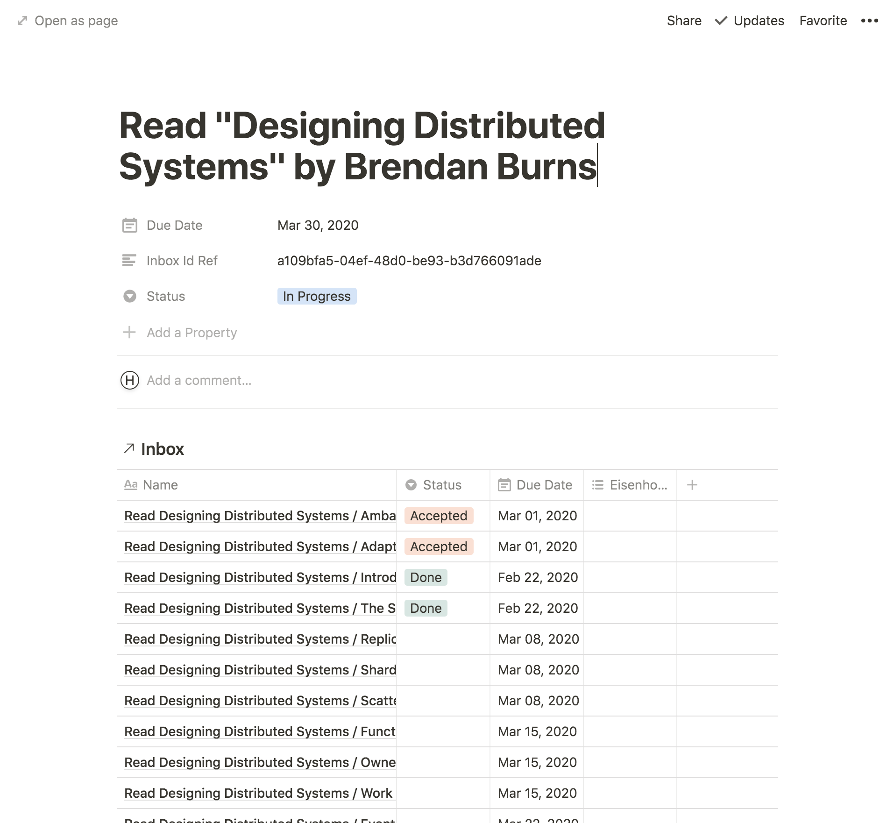
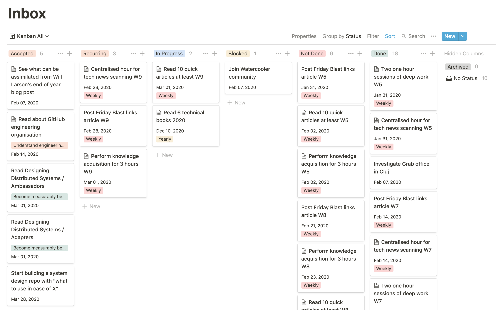
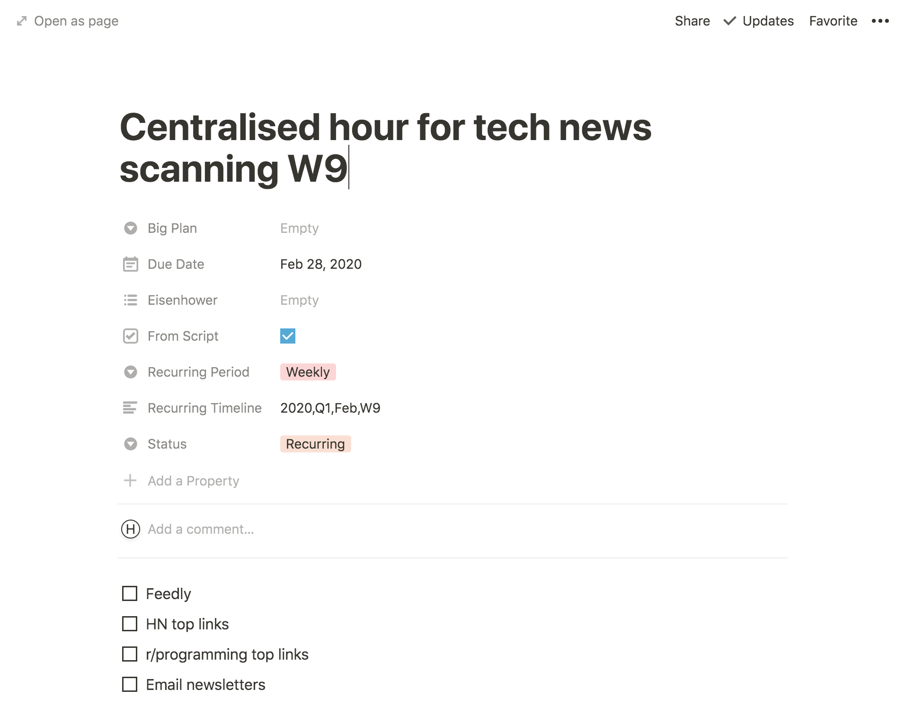

# Concepts

## Intro

Jupiter is a tool for _life planning_. It is _opinionated_ in how it approaches
this problem. The goal of this page is to document Jupiter's conceptual model
and how life planning is mapped to it.

There will be references made to the current implementation. But the concepts
are _separate_ from it, and could just as easily be implemented via pen & paper.

## Overview

As a quick reference, here is the list of the more important concepts:

* _Workspace_: the _place_ where all the work in Jupiter happens.
* _Project_: the _place_ where some of the work happens. This is normally a
  neatly defined part such as "Personal" goals or "Career" goals, etc.
* _Task_: an atomic unit of work. This is normally something like "Congratulate
  Jeff on the speech", or "Buy new socks".
* _Big plan_: a larger unit of work, consisting of multiple tasks. This is normally
  something like "Plan a family vacation", or "Get a talk accepted to a conference".
* _Recurring task_: a template for tasks which occurs regularly. This is either
  some sort of chore, like "Change AC filters", or some sort of habit, such as
  "Walk 10K steps".

The rest of the document will cover each of these in greater detail.

> Note: When referencing Jupiter commands, we’ll use `jupiter foo` instead of the current
Docker based `docker run -it --rm --name jupiter-app -v $(pwd):/data --env TZ=Europe/Bucharest jupiter foo`.
We’ll get there _sometime_ too, but for the sake of brevity it’s easier this way.

As a general consideration, every action in Jupiter is done via a command in the `jupiter` CLI app. It will affect
both the local storage and Notion at the same time. You can edit things in Notion, and for most things it will be
easier to go this route though. So you'll need to run special `sync` commands to keep the local store and Notion in
sync.

## Workspace

All the work for life planning takes place in a _workspace_. When you use
`jupiter ws-init` in a local directory, you’re starting up your workspace. The local
directory and its files, the Notion.so pages created, etc. are all part of the
workspace.

You can have multiple workspaces, and they can even share the same Notion.so
space/account, but realistically it makes sense to use just one. All further
concepts we discuss are _relative_ to the workspace.

Workspaces are created via the `jupiter ws-init` command. `jupiter ws-init` is idempotent, and is a good way to
update workspaces as newer versions of the tool appear.

After creating a workspace, you’ll see something like the following in the Notion
left hand bar - here with a couple of projects too at the top-level under “Plans”,
namely “Personal”, “Engineer 2.0”, “Work @Bolt”, etc:



### Workspace Interactions Summary

You can:

* Create a workspace via `ws-init`
* Set the name of the workspace via `ws-set-name` or editing the name in Notion directly
* Set the token of the workspace via `ws-set-token`.
* Synchronise changes between the local store and Notion via `ws-sync`.
* See a summary of the workspace via `ws-show`.

### Workspace Properties

Workspaces have several important properties:

* The name is specified when calling `ws-init` and can be overwritten via `ws-set-name`. It's the name of
  the root page in Notion too.
* The token is specified when calling `ws-init` and can be overwritten via `ws-set-token`. It's the secret used to
  access Notion. From time to time it expires, so it needs tob be updated here as well. The token can be obtained
  as described in the [tutorial section](https://github.com/horia141/jupiter/blob/master/docs/tutorial.md).
* The space id is specified when calling `ws-init`. It identifies the Notion "space" where Jupiter will things up. It
  can't be changed after creation though.

### Workspace Syncing

When you edit something in Notion, Jupiter does not see the changes immediately. Instead you need to run special
syncing commands to make sure Notion and the local storage are in sync. The `ws-sync` command achieves this for
workspaces. Presently, just the name can be changed, by editing the root page's name.

## Vacations

A _vacation_ is a set period of time when some scheduled tasks aren't scheduled. Vacations are attached to the
workspace. They can be created both via Jupiter commands and in Notion.

After creating a workspace you'll have an empty set of vacations. Adding to them you can obtain something like:


Alternatively you can see vacations via `vacations-show` like so:

```bash
$ jupiter vacations-show
INFO:commands.vacations_show:Loaded workspace data
id=6 Barcelona trip start=2020-03-20 end=2020-04-04
id=7 Eurotrip 2 start=2020-04-07 end=2020-04-22
```

### Vacations Interactions Summary

You can:

* Create a vacation via `vacations-add`, or by creating a new row in the "Vacations" page.
* Remove a vacation via `vacations-remove`, or by removing the row in the "Vacations" page.
* Change the name of a vacations via `vacations-set-name`, or by changing the name of the row in the "Vacations" page.
* Change the start date of a vacation via `vacations-set-start-date`, or by changing it in the "Vacations" page. The
  start date cannot be after the end date, and either the command or the sync will fail if it is.
* Change the end date of a vacation via `vacations-set-end-date`, or by changing it in the "Vacations" page. The
  end date cannot be before the start date, and either the command or the sync will fail if it is.
* Synchronise changes between the local store and Notion via `vacations-sync`.
* See a summary of the workspace via `vacations-show`.

### Vacations Properties

A vacation has several properties:

* The name is specified when calling `vacations-add` and can be overwritten via `vacations-set-name`. It's the
  name of the vacation, and will show up in Notion too.
* The id is an unique identifier for a vacation, assigned when calling `vacations-add` or `vacations-sync`. It's
  used to refer to a vacation for various commands.
* The start date is the time when the vacation starts, and tasks should not be generated. It should be before the
  end date. You can set it at creation time, or via `vacations-set-start-date`, or from Notion.
* The end date is the time when the vacation end, and tasks should again be generated. It should be after the
  start date. You can set it at creation time, or via `vacations-set-end-date`, or from Notion.

### Vacations Syncing

When you edit something in Notion, Jupiter does not see the changes immediately. Instead you need to run special
syncing commands to make sure Notion and the local storage are in sync. The `vacations-sync` command achieves this
for vacations. It adds new vacations from Notion, removes the ones not present locally, and also creates them
remotely if they're in the local store, but not in Notion. Any changes in Notion will also be reflected in the local
store.

## Projects

The workspace contains _one or more_ _projects_. If the workspace is where all the
work happens, a project is where some part of the work happens. Usually some
coherent subset of it.

For example, you can have a project for your personal goal tracking, and one for
your career goal tracking etc. In most cases just one or two projects are enough,
and they should be very long lived things.

Projects are created via the `jupiter create-project ${user.yaml} ${project.yaml}`
command. The `project.yaml` file has the following format:

```yaml
name: “Work”
key: work

groups:
  # We’ll go into details here when speaking about recurring tasks.
```

`jupiter create-project` is idempotent, and is a good way to update projects as
newer versions of the tool appear.

After creating a project, you’ll see something like the following in the Notion
left hand bar - here with two Jupiter created pages (“Inbox” and “Big Plan”) and one
regular Notion page (“Blog Ideas”):



## Tasks

A task is some atomic unit of work. Tasks live in the “inbox”. A task is ideal
to model work which can be done in anything from a minute, to a day, excluding
wait or idel times. They can be created by hand, or automatically as recurring
tasks for a certain period.

For example, you can have a task like "Change AC filter", or "Take visa papers to
embassy", or "Research team off-site locations".

Tasks have a _status_, which can be one of:

* _Accepted_: all tasks you created by hand should start with this status. It means
  you’re going to start working on the task in the near future.
* _Recurring_: all tasks you created via recurring tasks and `jupiter upsert-tasks`
  start with this status. It means you’re going to start working on the task in the
  near future.
* _In Progress_: all tasks you’re currently working on should be placed in this
  status. Once you start working on a task you should move it to this status, and
  keep it there until it’s finished or the parts that depend on you are done, and
  you can move in the “Blocked” state.
* _Blocked_: all tasks that are currently handled by _someone else_, and their
  completion is not in your hands. Once your part of the task is done, you should
  move it to the “Blocked” status. It can move back and forth to “In Progress”,
  and then to “Not Done” or “Done”.
* _Done_: all tasks that are finished, with the desired outcome.
* _Not Done_: all tasks that are finished, but not with the desired outcome.
* _Archived_: tasks which have been archived via `jupiter archive-done-tasks` are
  moved here. You can also achieve them via manually changing their status too.
* _No Status_: tasks which you perhaps created, but don’t plan on actioning in any
  way.

In the Inbox, you can see tasks in a sort of Kanban board, organised by status like
this:


The state evolution diagram is:


You can create a task via regular Notion mechanisms (pressing the various "New" buttons),
or Jupiter can create one for you from the recurring tasks templates via
`jupiter upsert-tasks`. You can remove a task by simply removing the Notion record of it.

Tasks have a deadline. It’s optional, but it’s strongly recommended you add one
as a goal setting rule.

Tasks can also be labeled according to the [Eisenhower matrix](https://www.eisenhower.me/eisenhower-matrix/),
as either _urgent_ or _important_.

In Notion a task might look like this:



The “From Script”, “Recurring Period” and “Recurring Timeline” fields are relevant
only for recurring tasks.

### The Inbox

The inbox is a representation of your current work, as well as the work you recently
finished or will recently start. It's a collection of tasks. They are created here
in the “Accepted” or “Recurring” states, depending on who created them (you, or
the system via `jupiter upsert-tasks`, respectively).

The inbox looks like a Kanban board usually, with the various states of a task as
columns.


There are multiple views for the inbox though right now:

* _Kanban All_: views all tasks in the inbox as a Kanban board.
* _Database_: views all tasks in the inbox as a Excel-like table.
* _Kanban Due $InPeriod Or Exceeded_: views all tasks due in a certain period
  (week or month) or those that have exceeded their deadlines as a Kanban board.
* _Not Completed By Date_: views all not done tasks in a calendar. Having due
  dates is important for this purpose.

Here’s a sneak peak at some views:




The inbox can get cluttered with time as you finish more and more tasks. The
filtered views help a bit, but due to limitations in how Jupiter interacts with
Notion, after some point there are performance issues. Some things you can do to
do garbage collection is running:

* Task archival via `jupiter archive-done-tasks {user} {project}`. This operation
  simply changes any tasks with the “Not Done” or “Done” status to the “Archived”
  status, which essentially makes them invisible.
* Task removal via `jupiter remove-archived-tasks {user} {project}`. This
  operation actually removes the tasks with the “Archived” status from Notion.
  They’ll be available in the Notion trash, but quite hard to recover.
  Note - this will be improved in the future.

## Big Plans

Big plans are larger units of work. They are made up of multiple tasks. Big plans
live in the "Big Plan page". A big plan is ideal to model work which can be done
in anything from a week to several months, and which consists of multiple steps.

For example, you can have a task like "Plan a family vacation", or "Get a talk
accepted to a conference", or "Buy a new house".

Big plans have a _status_, which can be one of:

* _Accepted_: all big plans you create should start with this status. It means you're
  going to start working on this plan in the near to medium future.
* _In Progress_: all big plans you're currently working on should be placed in this
  status. Once you start working on some tasks from the plan, it can be counted as being
  in progress.
* _Blocked_: all big plans that you're currently not able to push through for some reason.
  Either all tasks are blocked, or you can't start on any new ones, etc. It can move back
  and forth to "In Progress", and then to "Not Done" or "Done".
* _Done_: the big plan is finished, with the desired outcome.
* _Not Done_: the big plan is finished, but not with the desired outcome.
* _Archived_: the big plan has been archived, currently just a manual operation.
* _No Status_: some big plans don't have a status for various reasons.

In the big plan page, you can see big plans in a sort of Kanban board, organised by status
like this:



The state evolution diagram is:


You can create a big plan via regular Notion mechanisms (pressing the various "New"
buttons). You can remove a big plan by simply removing the Notion record of it.

In order for things to properly work out however, you also need to run
`jupiter upsert-big-plans`. This makes sure that the big plans are setup correctly, and
that the various Notion pages know about the new or removed big plan. It is an idempotent
operation, useful to use in case of updates too.

Big plans also have a deadline. It's optional, but it's strongly recommended you add one
as a goal setting rule.

In Notion a big plan might look like this:



Notice there is a link to the project's Inbox for the tasks associated with that plan. You
can view the completion status here.

You can create a task for the big plan directly here, or you can create one in the Inbox
and link it via the `Big Plan` property.

### Big Plans Page

The big plan page is a representation of your current and longer term work. It's a
collection of big plans. They are created here in the "Accepted" state.

The big plan page looks like a Kanban board, with the various states of a big plan as
columns.


## Recurring Tasks

A recurring task is some periodic and atomic unit of work. Recurring tasks live in the
"project file", but they're instantiated as regular tasks in the "inbox". A recurring
task is ideal to model work which needs to be done periodically, like a chore or a habit.

For example, you can have a recurring task like "Clean out AC filters every week", or
"Pay home insurance every month", or "Walk more than 10000 steps every day".

Recurring tasks have a _period_ and a _period interval_. The former is set via the `period`
property and the latter is derived uniquely from this. The period can be one of:

* _Daily_: a task which needs to happen once a day. In a year there will be 365 or 366
  instances of such a task, and the period interval for each one will be each day. The
  intervals are numbered from 1 to 365.
* _Weekly_: a task which needs to happen once a week. In a year there will be 52
  instances of such a task, and the period interval for each one will be the corresponding
  week. The intervals are numbered from 1 to 52.
* _Monthly_: a task which needs to happen once a month. In a year there will be 12
  instances of such a task, and the period interval for each one will be the corresponding
  month. The intervals are numbered from 1 to 12.
* _Quarterly_: a task which needs to happen once a quarter (group of three months). In a
  year there will be 4 instances of such a task, and the period interval for each one will
  be a group of three consecutive months (Jan/Feb/Mar, Apr/May/Jun, Jul/Aug/Sep, and Oct/Nov/Dec).
  The intervals are numbered from 1 to 4.
* _Yearly_: a task which needs to happen once a year. In a year there will be 1 instance
  of such a task, and the period interval for it will be the full year. The intervals
  are numbered by the year.

Notice that the smallest period is the `daily` one, with a period interval of one day. In
general, for a given period interval there can be only one instantiation of a task of that
period.

In the project file the tasks might looks like:

```yaml
name: "Engineer 2.0"
key: engineer-20

groups:
  knowledge:
    format: "{name}"
    tasks:
      - name: Tech news scanning
        period: weekly
        due_at_day: 5
      - name: Read 10 articles
        period: weekly
```

While in the inbox, the instantiated tasks might look like this - notice the "Weekly" and
"Monthly" labels:



The instantiated task in the inbox is constructed from the recurring task template, but
it also changes in the following way:

* The name contains the period interval for which the task is active. So "Pay home
  insurance" becomes "Pay home insurance Mar". The formats are "Mar13" for daily periods,
  "W13" for weekly periods, "Mar" for monthly periods, "Q1" for quarterly periods,
  and "2020" for yearly periods.
* The "From Script", "Recurring Period" and "Recurring Timeline" fields are populated. But
  they are rather implementation details.

Recurring tasks also have a deadline. By default the deadline is the end day of the period
interval, at midnight. You can override it however to specify, via the `due_at_day` and
`due_at_time` properties. They work like so:

* For tasks with daily period, only the `due_at_time` property can be set. For example
  `due_at_time: "17:00"` will mark a task as due at 5PM in the local timezone, as opposed
  to 11:59PM in the local timezone.
* For tasks with weekly and monthly periods, the `due_at_day` and `due_at_time` property
  can be set. For example `due_at_day: 10` will set the deadline of a monthly task
  to be the midnight of the 10th day of the month. Adding `due_at_time: "13:00"` will
  mark it as due at 1PM in the local timezone on the 10th day of the month.
* For tasks with quarterly and yearly periods, the `due_at_month`, `due_at_day` and
  `due_at_time` property can be set. For example `due_at_month: 3` will set the deadline
  of a yearly task to be the midnight of the last day of March. Adding `due_at_day: 10`
  will mark it as due at midnight of the 10th of March. and adding `due_at_time: "13:00"`
  will mark it as due at 1PM on the 10th of March.

Recurring tasks have subtasks. This is a neat facility to breakup work into even smaller
pieces, usually the steps in a multi-step process. The `subtasks` property is used to
configure these, like so:

```yaml
groups:
  learning:
    format: "{name}"
    tasks:
    - name: Tech news scanning
      period: weekly
      subtasks:
      - name: Hacker News
      - name: r/programming
```

In Notion an instantiated task might look like this then:



Recurring tasks can be configured to skip certain periods via a skip rule. This is
specified via the `skip_rule` property, which can be one of:

* `odd`: skips the odd numbered intervals for the period. More precisely, the day/week/
  month/quarter number within the year is checked to be odd. For yearly periods, the year
  itself should be odd.
* `even`: skips the even numbered intervals for the period. Same rules apply as above.
* A set of values: skips the intervals within this set. For example, if the property is
  `skip_rule: [1, 4, 7]` and `period: "weekly"`then the 1st, 4th and 7th weeks of the year
  are skiped.

Recurring tasks also have a group. Or rather, you need to place the tasks in a group
as part of the project file format. The group serves just a organisational purpose, but
isn't (yet) reflected anywhere else. A multi-group project might look like this:

```yaml
groups:
  learning:
    format: "{name}"
    tasks:
    - name: Tech news scanning
      period: weekly
  blogging:
    format: "{name}"
    tasks:
    - name: Publish one blog article
      period: monthly
```

Recurring tasks interact with vacations too. More precisely, if a task's period interval
is fully contained within a vacation, that task won't be instantiated in the inbox via
`jupiter upsert-tasks`. For example, if you have a vacation from Monday `2020-02-09` to
Sunday `2020-02-15`, then all daily and weekly tasks for that week won't be created, but
all monthly, quarterly and yearly ones will.

A recurring task can be mark as "must do", via the `must_do` property, and that will cause
it to ignore vacations. For example, paying rent or taking some medicine can't be
interrupted by a vacation.

Recurring tasks are created via the `jupiter upsert-tasks` command. This has some special
forms too:

* `jupiter upsert-tasks {user} {project}` is the standard form and inserts all of the
  tasks whose period interval includes today. Thus, all daily tasks will be inserted, and
  all weekly tasks for this week, etc. Of course, if the tasks for this week have already
  been instantiated, they won't be again.
* `jupiter upsert-tasks {user} {project} --date=YYYY-MM-DD` does an insert as if the day
  were the one given by the `date` argument. Useful for creating tasks in the days before
  the start of a certain week or month.
* `jupiter upsert-tasks {user} {project} --group=GROUP` does an insert only on the
  tasks for the particular group given by the `group` parameter.
* `jupiter upsert-tasks {user} {project} --period=PERIOD` does an insert only on the
  tasks with a certain period. Useful to speed up inserts when you know you only want
  new tasks for the next day or week.

The `jupiter upsert-tasks` command is idempotent, as described above. Furthermore it does
not affect task status, or any extra edits on a particular instance of a task. Only
archived and removed tasks are regenerated.

### The Project File

The project file is a representation of your recurring tasks. It's a file right now you
need to manage, and doesn't (yet) have any Notion representation.

It's a `yaml` file which looks like this:

```yaml
name: "Engineer 2.0"
key: engineer20

groups:
  learning:
    format: "{name}"
    tasks:
    - name: Tech news scanning
      period: weekly
  blogging:
    format: "{name}"
    tasks:
    - name: Publish one blog article
      period: monthly
```

The `name` is self-explanatory and `groups` has been covered above. The `key` field
is a unique identifier for the project in your workspace. While you can change the name,
add and remove groups and tasks, you should _never_ change the key. This would result in
Jupiter not recognising the Notion structures and starting over again with them.
