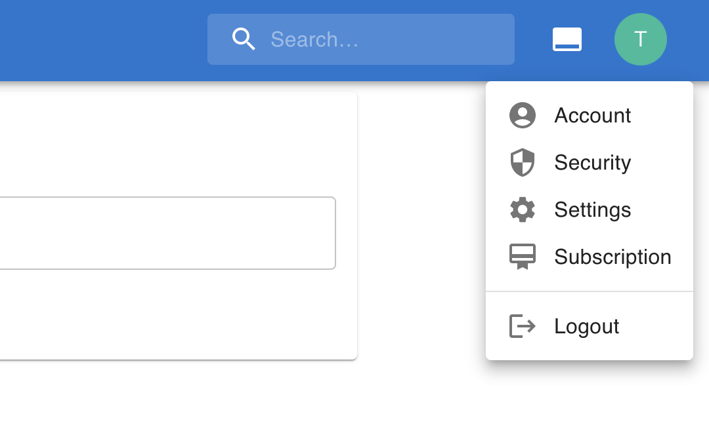
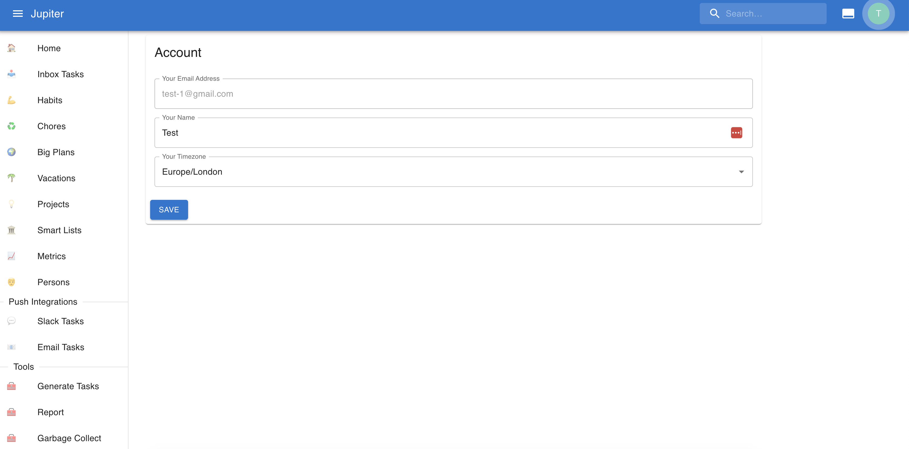
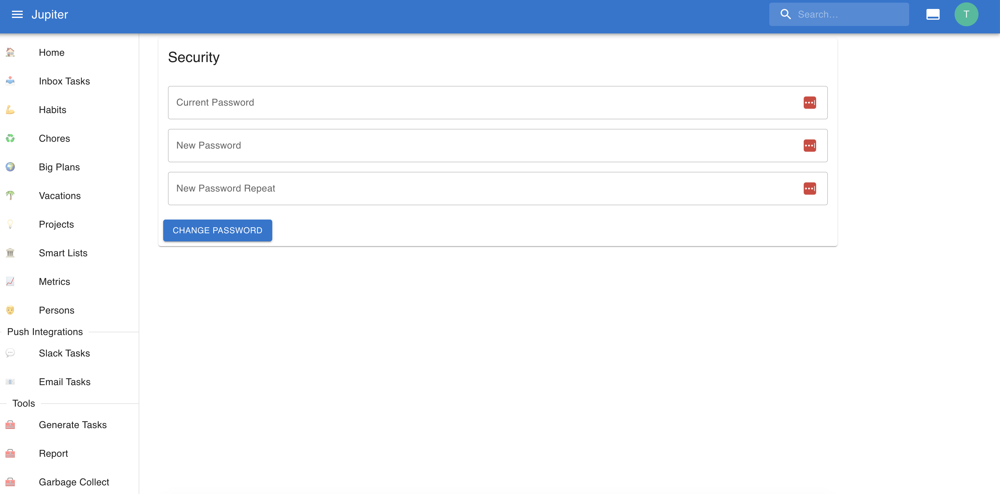

# Accounts

The account is the way you indentify yourelf relative to Jupiter. The _unique identifier_
is your email address.

Your account is uniquely linked to your [workspace](./workspaces.md) and this is private
to you.

You can create an account (and associated workspace) as [shown here](../how-tos/install.md).

## Properties

An account has an email. This is your unique identifier you are known by in Jupiter.

An account has a name. This is simply the name that you want to be known by in Jupiter,
but it doesn't carry any other constraints other than being non-empty.

An account also has a timezone. This is the preferred timezone in which you wish to see
dates.

Naturally, login credentials are linked to the account. Besides the password, there is
also an account recovery token that you need to [keep in a safe space](../how-tos/recover-your-account.md).

## Interactions

In the Web app you can access account and security controls in the right-hand menu.

You can update some properties, but not your email.

Security info can also be changed.

In the CLI app you can:

* Change user properties via `user-update`
* Show user details via `user-show`
* Change your password via `auth-change-password`
* Recover your account via `reset-password`