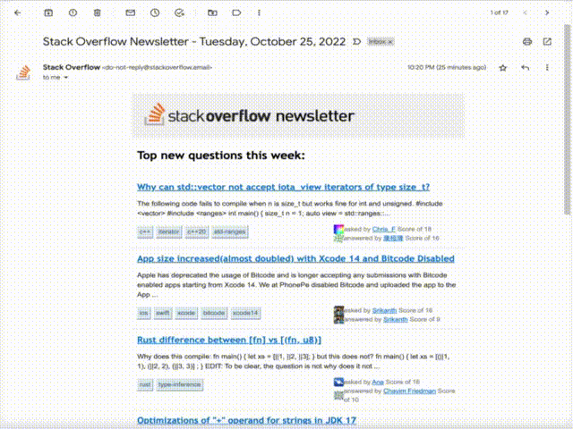
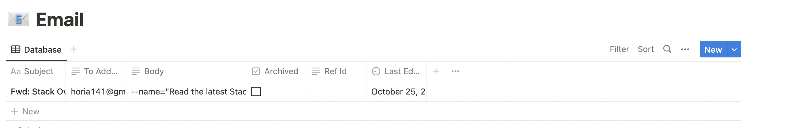
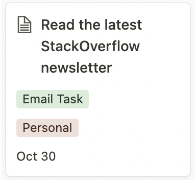
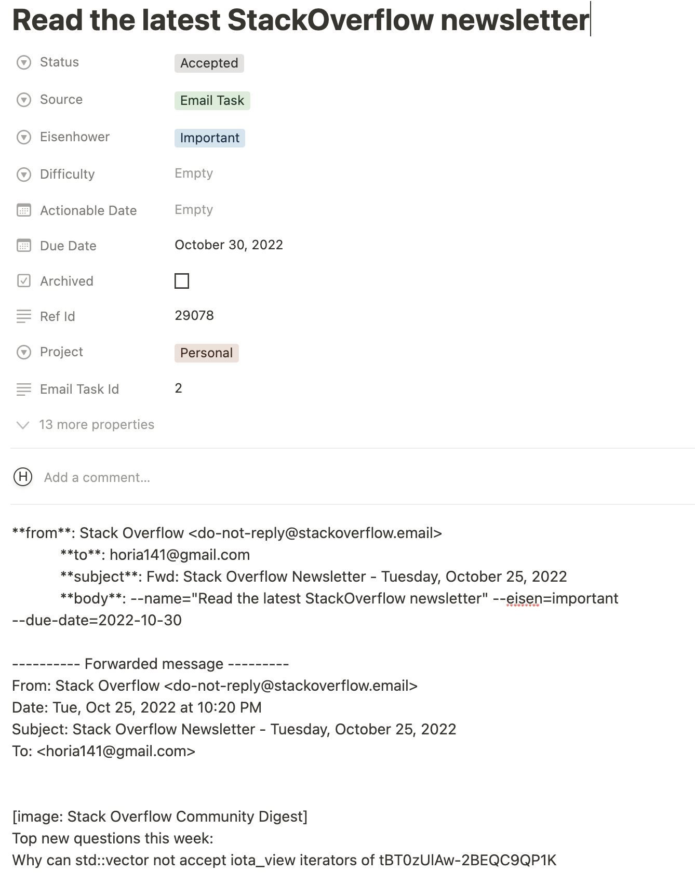

# Email Tasks

A Email task is a unit of work originating from an email message.

Email is a also a work tool, and many of the messages on it imply some sort of action on your part.
Which means that an inbox task should be created. This particular integration simplifies
and enhances the flow for creating such tasks like in the following example:

You'll then see something like the below in the `Push Integrations > Email` section on
Notion.

After this you can `sync` to reflect the Notion changes locally and then `gen` to
create an associated [inbox task](inbox-tasks.md) for this email task. It would look
something like this:

The above flow focuses on the specific case of receiving a message and creating a sort
of reminder for it via Jupiter. But it's not the only possibility. Indeed, there's no
constraint on what sort of _processes_ create these email tasks. You can:

* Create one by hand just for the sake of it. There's no CLI command for doing this, but Notion allows
  you do by default. It's pretty useless, though editing an already created Email task is rather useful.
* Create one via forwarding a message to a specific email address (see below)

An email task in itself is a rather technical concept. You should care that you
can create tasks from Email in various ways. And leave the Notion representation
as a secondary thing.

## Zapier Integration Notes

With the Zapier integration between email and Notion you are making use of the
ability to send email to a particular address and have Zapier forward it into
a Notion database.

You need to forward the message to a special email address, and it
needs to be in a proper "forwarded" format for this to work.

You can also add some extra text. This is optional, but you can provide
things like difficulty or Eisenhower properties for the generated inbox task,
in the same way you'd be doing via the CLI. That means using the `--name`,
`--eisen` or `--difficulty` parameters like in the example video. If no
`--name` is specified, one is generated from the message's data.

Checkout [how to use Zapier to link Email with Jupiter](../how-tos/use-email-as-a-source-for-inbox-tasks.md).

## Email Tasks Properties

Each email task originates from a message on Email. Hence the properties are reflections of
these.

Each email task has a from address and from user, who are the people (or companies)
sending the email in the first place.

An email also has a "to address" which is one of your own email addresses you received the
message on.

An email also has the subject and part of the body of the full email. Notion limitations restrict
just how much of it can be saved.

Finally, there is a freeform part called "Extra info". This can be empty, but it
is otherwise extra command information provided via the integration. This appears before
the forwarded body of the email. The contents here need to be CLI-style options for the inbox
task that is going to be generated. Anything you can specify there, you can specify here too.

## Email Tasks Interaction Summary

You can:

* Remove a Email task via `email-task-archive`
* Change any number of Email task properties via `email-task-update`, or by editing the row in Notion.
* Show the Email tasks database via `email-task-show`, or by looking in Notion.

Notice that you can't create such a task from the CLI, since other tools should handle
creation here.
