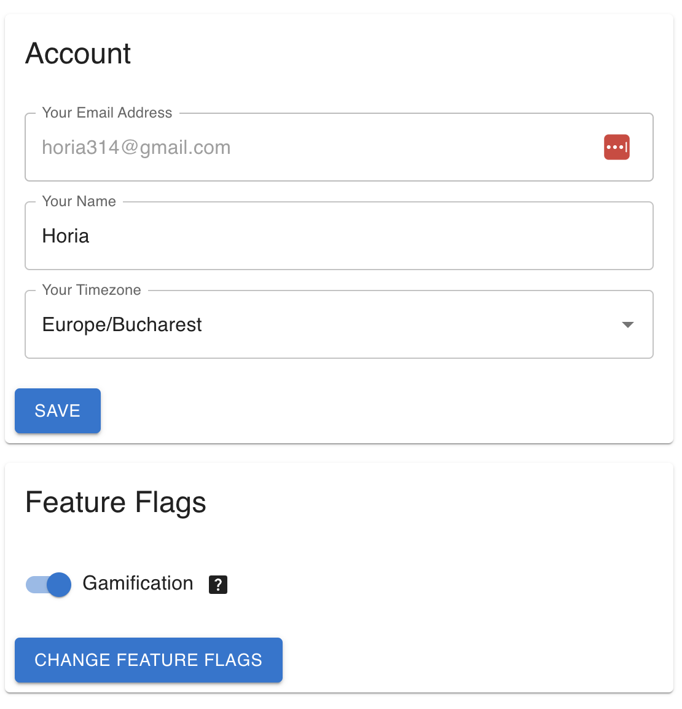

# Gamification

Jupiter has a simple notion of [gamification](https://en.wikipedia.org/wiki/Gamification) built in.
It is optional though, see below.

The focus is on completing [inbox tasks](inbox-tasks.md) and [big plans](big-plans.md). Every piece of
work completed successfully scores one or more points. The larger the work, the more points are scored.

Right now things look like:

* An easy difficulty inbox task - 1 point
* A medium difficulty inbox task - 2 points
* A hard difficulty inbox task - 5 points
* A big plan - 10 points

If a task or plan is completed unsuccesfully then the points are subtracted.

There's also a random "lucky puppy" bonus you get from time to time on successful tasks. It is worth
one point.

The points you score add up over time. There's a daily, weekly, monthly, quarterly, yearly and lifetime
total scores that Jupiter tracks.

You can view the daily and weekly score summary in the Web UI:

A more comprehensive view is shown in the gamification menu you get to by clicking on the scores.
You can see the current scores, as well as best daily/weekly/monthly/quarterly/yearly ones so far,
recorded for the last quarter, year, and even the whole lifetime.

If there's enough data, you can also see a graphical history of your scores.

Just for reference, the number of inbox tasks and big plans are also recorded and shown.

## Enabling Gamification

Gamification is not everyone's cup of tea, hence it is optional. It is controlled at the user level,
not the workspace level, like many of the [other features](feature-flags.md).

Like with all feature flags, disabling gamificaiton does not delete any data. It just hides the current
data, UI controls, and commands. It does however block the recording of scores, hence any _progress_ you
make while gamification is disabled won't get tracked.

At account creation time you can opt in or opt out of it:

Similarly, later on you can enable or disable it from `Account` settings:

