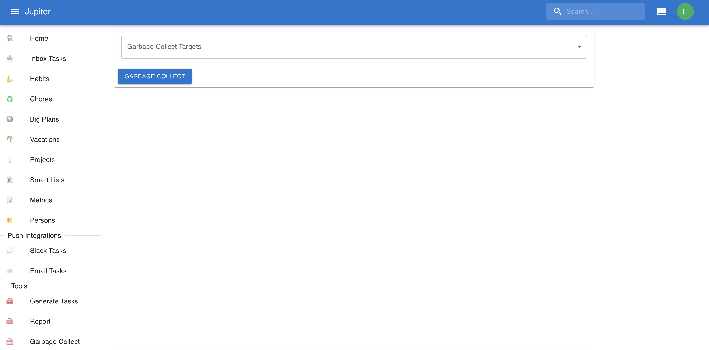

# Garbage Collection

Garbage collection is a periodic action you must perform. It cleans up tasks and big plans that are
completed and otherwise lingering on in the system.

It needs to be performed weekly usually.

In the web app you can find reporting in the `Garbage Collect` left-hand side tab, under _tools_. It looks
something like this:

After pressing the `Garbage Collect` button, completed inbox tasks and big plans are archived. This makes
them invisible for most views.

The CLI command is called `gc` and has the same capabilities as the Web App.

The command is idempotent, so you can run it however many times you want and it'll do the right thing.
Furthermore it does not affect task status, or any extra edits on a particular instance of a task, besides
marking some entities as archived.
