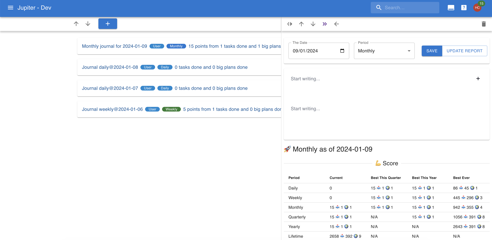
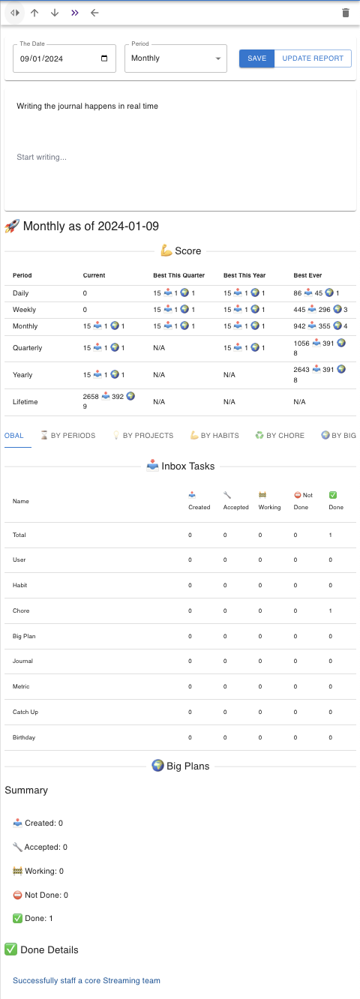

# Journals

A journal is a brief recounting of how a particular day, week, month, or other time period went. Journals live in the "journals" view.

## Journals

Journals are written on a particular _day_ for a particular _period interval_. The period can be one of:

* _Daily_: the day's journal
* _Weekly_: the week's journal, as recorded on the particular _day_.
* _Monthly_: the month's journal, as recorded on the particular _day_.
* _Quarterly_: the quarter's journal, as recorded on the particular _day_.
* _Yearly_: a whole year's journal, as recorded on the particular _day_.

Only one journal can exist for a particular _day_. Furthermore, a 
single journal can exist for a particular _period_ in time (so you
better write the journal of that period towards the end of it).

Journals are mainly a written artifact, so they're essentially one big document. But they do have a recording ot the work activity 
that happened during that period (scores achieved, tasks done, etc),
much like in the [report functionality](reporting.md).

## Interaction

In the web app you can change the properties of the journal by
clicking on it in the view.

Editing the document gets saved in real time.

There's no CLI support for journals yet!
