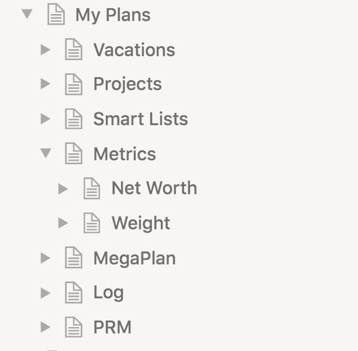
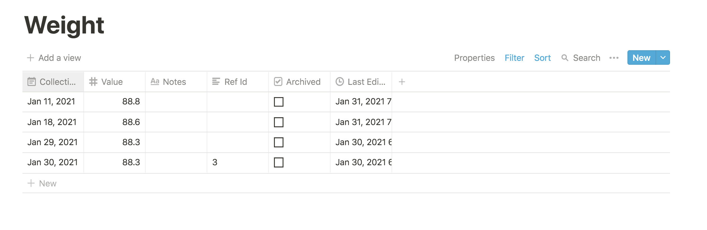

# Metrics

Metrics are a measure of the evolution in time of some aspect of your life. It is often useful to
quantify certain aspects of your life, and keep special tabs on it. Metrics allow you to track
your weight, your retirement savings, days gone to the gym, miles run, etc.

In the workspace overview, you can view the set of metrics:

Each metric contains many entries or records, for example:

Much like [projects](projects.md), metrics are created via the
`jupiter metrics-create --metric $smartListKey --name "Metric Name"` command. The command is
idempotent. The key plays the same part it does for a project, is a unique identifier for the
metric, and must be some nice string with no spaces or funny characters like `books` or `movies`.
It will be used as a reference to the project in other commands.

Metrics have a name. It's the nicely looking counterpart to the key.

Metrics can also have a _unit_. It adds extra info about what exactly you're recording - weight,
currency, the count of an event, etc.

Metrics can have a _collection project_ and _collection period_. It makes sense to record (or collect)
the value of a metric regularly. Think of your weight or the number of kilometers run in a week. To
allow for this, special collection inbox tasks can be generated for the metric, just like a
[recurring task](./recurring-tasks.md). The collection period will determine how often the task
is generated (weekly, monthly, etc.). The inbox tasks will go to the configured [project](./projects.md)
if it is present, or to the [default workspace one](./workspaces.md) if it is missing. If none
are present, generation will fail. There's also all the other collection parameters (actionable
dates, due dates, Eisenhower statuses, etc).

## Interaction Summary

You can:

* Create a metric via `metric-create`.
* Remove a metric via `metric-archive`.
* Change the name via `metric-update`, or by changing the name of the page in Notion.
* Change the collection project via `metric-update`. This cannot be changed from Notion.
* Change the collection period via `metric-update`. This cannot be changed from Notion.
* Change the unit via `metric-update`. This cannot be changed from Notion.
* See a summary of the metrics via `metric-show`.

## Entries

Metric entries are the records of the value of a certain metric at a certain time.

Metric entries have a _collection time_ - the time they were recorded.

They also have a _value_ - the actual value for the metric at that particular time.

Metric entries can also have some notes attached to them, for any extra info you might want to add.

In general, you're going to create entries from Notion, and use [sync](notion-local-sync.md) to bring them
over to the [local store](local-storage.md).

## Entries Interaction Summary

You can:

* Create a metric entry via `metric-entry-create`, or by creating a new entry in the appropriate Notion table.
* Remove a metric entry via `metric-entry-archive`, or by clicking the archive checkbox in Notion.
* Change the collection time of a metric entry via `metric-entry-update`, or by changing the collection
  time from the Notion row.
* Change the value of a metric entry via `metric-entry-update`, or by changing the value from the Notion row.
* Change the notes of a metric entry via `metric-entry-update`, or by changing the notes from the Notion row.
