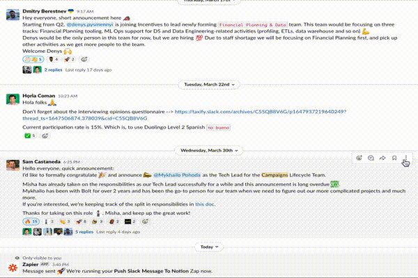
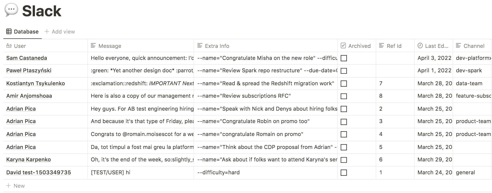
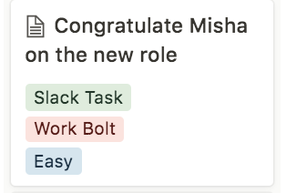
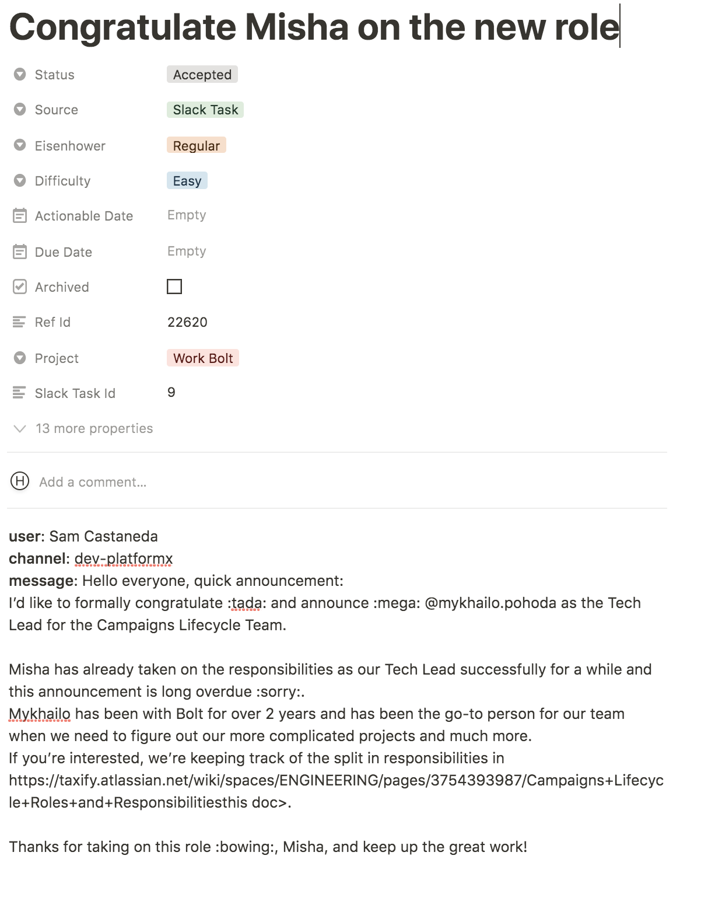

# Slack Tasks

A Slack task is a unit of work originating from a [Slack](https://slack.com/) message.

Slack is a work tool, and many of the messages on it imply some sort of action on your part.
Which means that an inbox task should be created. This particular integration simplifies
and enhances the flow for creating such tasks like in the following example:

You'll then see something like the below in the `Push Integrations > Slack` section on
Notion.

After this you can `sync` to reflect the Notion changes locally and then `gen` to
create an associated [inbox task](inbox-tasks.md) for this slack task. It would look
something like this:

The above flow focuses on the specific case of receiving a message and creating a sort
of reminder for it via Jupiter. But it's not the only possibility. Indeed, there's no
constraint on what sort of _processes_ create these Slack tasks. You can:

* Create one by hand just for the sake of it. There's no CLI command for doing this, but Notion allows
  you do by default. It's pretty useless, though editing an already created Slack task is rather useful.
* Create one via the `Push to Zapier` extension in Slack.
* Create one via a Zapier search for particular types of messages. Ones containing certain keywords,
  or coming from certain users or bots, or on certain channels.
* Create one from a totally different tool like Microsft Teams, Google Meet, and even Facebook
  Messanger.

A Slack task in itself is a rather technical concept. You should care that you
can create tasks from Slack in various ways. And leave the Notion representation
as a secondary thing.

## Zapier Integration Notes

With the Zapier integration in Slack and Notion you are making use of the
`Push to Zapier` functionality. This allows actions on a per-message basis. It
also asks you for some extra text. This is optional, but you can provide
things like difficulty or Eisenhower properties for the generated inbox task,
in the same way you'd be doing via the CLI. That means using the `--name`,
`--eisen` or `--difficulty` parameters like in the example video. If no
`--name` is specified, one is generated from the message's data.

Checkout [how to use Zapier to link Slack with Jupiter](../how-tos/use-slack-as-a-source-for-inbox-tasks.md).

## Slack Tasks Properties

Each Slack task originates from a message on Slack. Hence the properties are reflections of
these.

Each Slack task has a user, which is the person or robot who posted the message
in the first place.

A Slack task has a channel, which is the channel where the message was posted.
If this was a DM or a group conversation, then the channel is empty.

A Slack task also has a copy of the full message.

Finally, there is a freeform text field called "Extra info". This can be empty, but it
is otherwise extra command information provided via the integration. In the case of Zapier
it is the contents of the text box in the `Push to Zapier` option in Slack. The contents
here need to be CLI-style options for the inbox task that is going to be generated. Anything
you can specify there, you can specify here too.

Crucially, the Slack URL of the message isn't preserved yet.

## Slack Tasks Interaction Summary

You can:

* Remove a Slack task via `slack-task-archive`
* Change any number of Slack task properties via `slack-task-update`, or by editing the row in Notion.
* Show the Slack tasks database via `slack-task-show`, or by looking in Notion.

Notice that you can't create such a task from the CLI, since other tools should handle
creation here.
