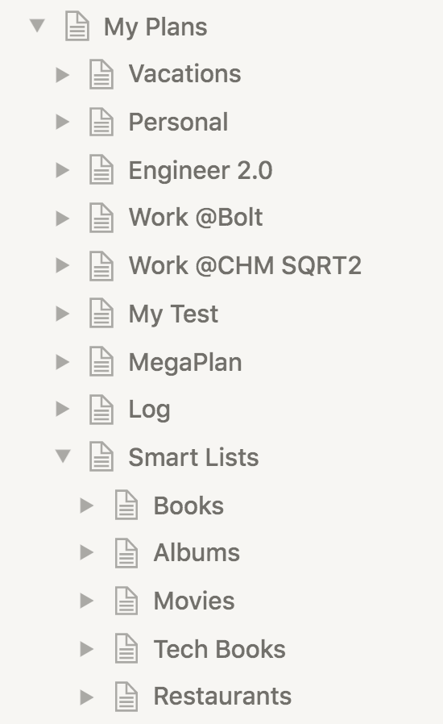
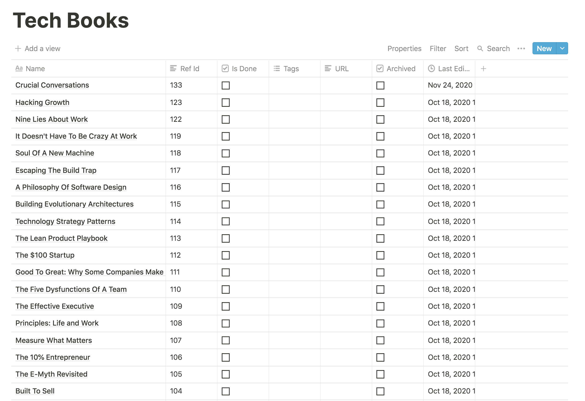

# Smart Lists

Smart lists are list for recording things! Organised people often keep lists. For example of
things they've done or plan to do. And they can be for anything: movies, books, courses,
songs, places, restaurants, etc. Lists are good for long term planning as they can allow
the construction of a plan outside of the formal constraints of [big plans](big-plans.md).

In the workspace overview, you can view the set of smart lists:

Each smart list contains many items, for example:

Much like [projects](projects.md), smart lists are created via the
`jupiter smart-lists-create --smart-list $smartListKey --name "Smart List Name"` command. The command is
idempotent. The key plays the same part it does for a project, is a unique identifier for the
smart list, and must be some nice string with no spaces or funny characters like `books` or `movies`.
It will be used as a reference to the project in other commands.

On their own, smart lists have a single property - their name.

## Interaction Summary

You can:

* Create a smart list via `smart-lists-create`.
* Remove a smart list via `smart-lists-archive`.
* Change the name via `smart-lists-set-name`, or by changing the name of the page in Notion.
* See a summary of the smart lists via `smart-lists-show`.

## Items

Smart list items are the actual books you want to read, movies you've seen, or courses you've attended.
They are attached to a particular smart list.

For example, you can have a smart list item like "The Godfather", or "Trafalgar Square", in your list of
movies, and places to visit, respectively.

Smart list items have a name.

Smart list items also have a notion of doneness. Many many times lists are built in order to act somehow on
them - go to a place, read a book, etc. To support this out of the box, items can be marked as "done".

Smart list items also have tags. You can use them to classify them or to keep track of info you otherwise can't
right now (author, year of publication, etc).

Smart list items also have an optional url. It can be used to provide extra information about the particular item,
such as an Amazon link where it can be bought, or the actual link of the actual interesting article you want to
read.

In general, you're going to create smart list items from Notion, and use [sync](notion-local-sync.md) to bring them
over to the [local store](local-storage.md).

## Items Interaction Summary

You can:

* Create a smart list item via `smart-lists-item-create`, or by creating a new entry in the appropriate Notion table.
* Remove a smart list item via `smart-lists-item-archive`, or by clicking the archive checkbox in Notion.
* Change the doneness status via `smart-lists-item-mark-done` or `smart-lists-item-mark-undone`, or by clicking on
  the checkbox in Notion.
* Change the name of a smart list item via `smart-lists-item-set-name`, or by changing the name from the Notion row.
* Change the tags of a smart list item via `smart-lists-item-set-tags`, or by changing the tags from the Notion row.
* Change the url of a smart list item via `smart-lists-item-set-url`, or by changing the URL field from the Notion row.
* Show info about the smart list items via `smart-lists-item-show`.
* There is a whole suite of `smart-lists-tag-*` commands for create/update/archival of tags.
