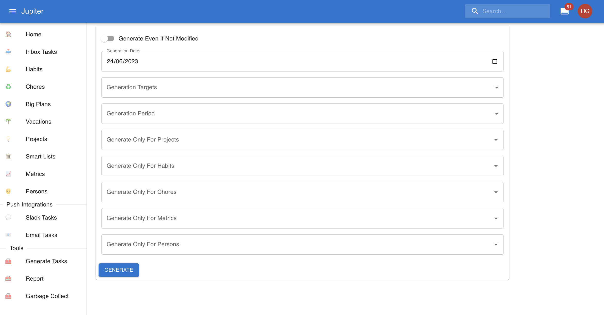

# Tasks Generation

Tasks generation is a periodic action you must perform. It takes the _templates_ that are
[habits](habits.md), [chores](chores.md), [metrics](metrics.md) or [persons](persons.md) and turns them into real
[inbox tasks](inbox-tasks.md).

It needs to be performed daily usually.

In the web app you can find reporting in the `Generate Tasks` left-hand side tab, under _tools_. It looks
something like this:

You can select a time for which you want the tasks generated. This helps with backfills and preparation
of tasks for the future.

Otherwise you can configure generation to filter by type of entity, period, etc. These are more advanced
filters, and are probably overkill for the majority of cases.

After pressing the `Generate` button, new tasks are created.

The CLI command is called `gen` and has the same capabilities as the Web App.

The command is idempotent, so you can run it however many times you want and it'll do the right thing.
Furthermore it does not affect task status, or any extra edits on a particular instance of a task.
If any property of the habit template which get copied over to the instance is modified, then the command
will take care to update the instance too. Only archived and removed tasks are regenerated.
