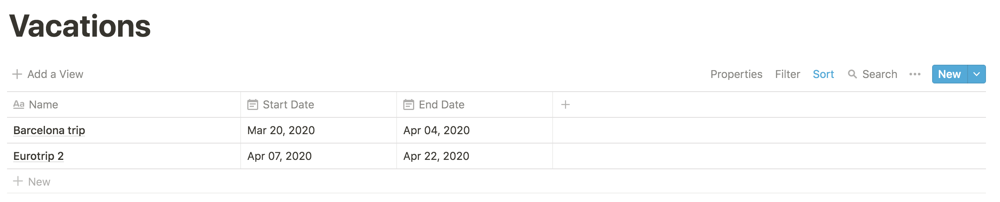

# Vacations

A _vacation_ is a set period of time when some scheduled tasks aren't scheduled. Vacations are attached to the
workspace. They can be created both via Jupiter commands and in Notion.

After creating a workspace you'll have an empty set of vacations. Adding to them you can obtain something like:



Alternatively you can see vacations via `vacations-show` like so:

```bash
$ jupiter vacations-show
id=6 Barcelona trip start=2020-03-20 end=2020-04-04
id=7 Eurotrip 2 start=2020-04-07 end=2020-04-22
```

## Vacations Properties

A vacation has a name. It's the name of the vacation, and will show up in Notion too.

The start date is the time when the vacation starts, and tasks should not be generated. It should be before the
end date.

The end date is the time when the vacation end, and tasks should again be generated. It should be after the
start date.

## Vacations Interactions Summary

You can:

* Create a vacation via `vacations-add`, or by creating a new row in the "Vacations" page.
* Remove a vacation via `vacations-remove`, or by removing the row in the "Vacations" page.
* Change the name of a vacations via `vacations-set-name`, or by changing the name of the row in the "Vacations" page.
* Change the start date of a vacation via `vacations-set-start-date`, or by changing it in the "Vacations" page. The
  start date cannot be after the end date, and either the command or the sync will fail if it is.
* Change the end date of a vacation via `vacations-set-end-date`, or by changing it in the "Vacations" page. The
  end date cannot be before the start date, and either the command or the sync will fail if it is.
* Synchronise changes between the local store and Notion via `vacations-sync`.
* See a summary of the workspace via `vacations-show`.
