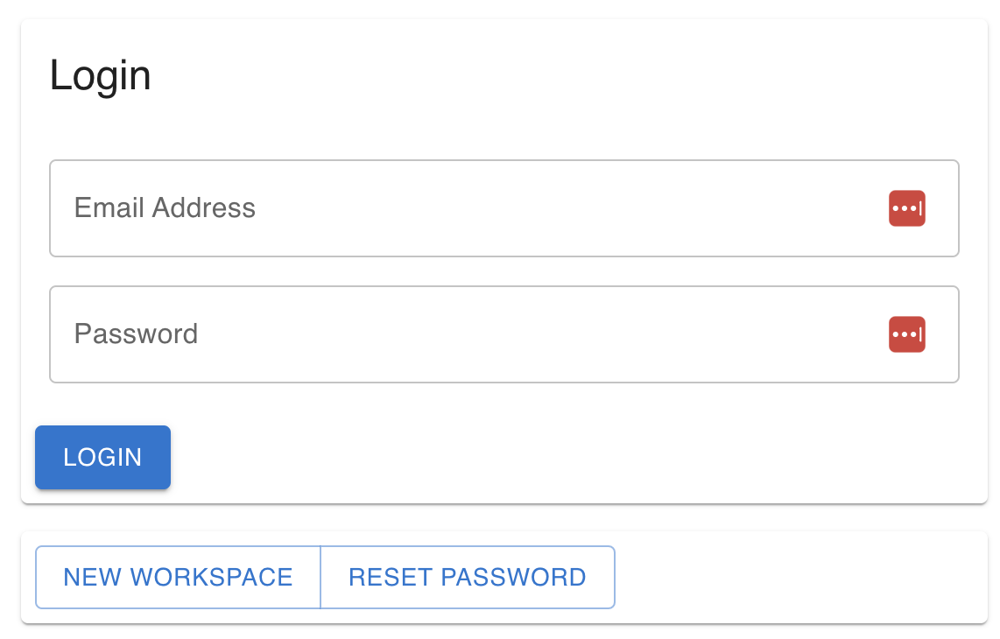
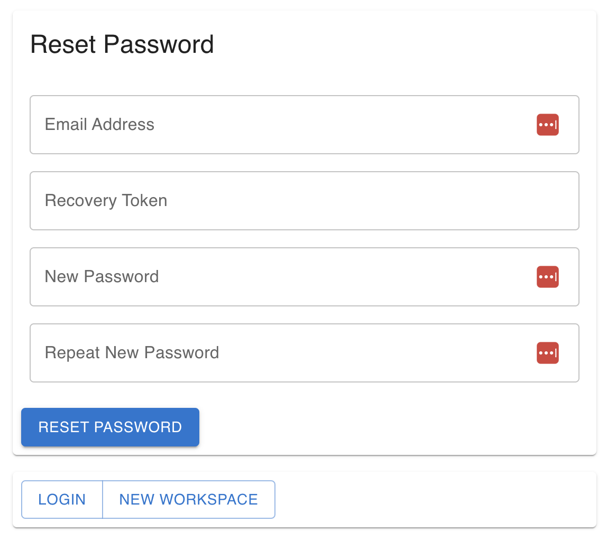

# Recover Your Account

If you somehow forget your account's password, you can recover your password by using the
account recovery feature and the recovery code that you got when [creating your account](../how-tos/install.md).

From the login page click the `Reset Password` button:

You'll be presented with the account recovery form:

You'll need your account email and recovery token. After setting the new password, your recovery
token will be changed and you'll need to save that too in a safe place.

If you've forgotten your account recovery token, please contact support!
