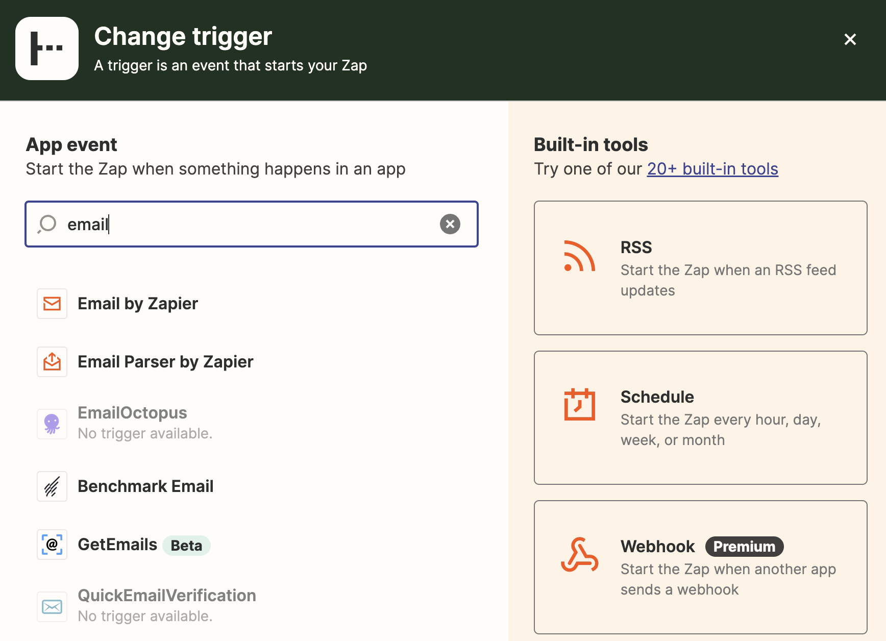
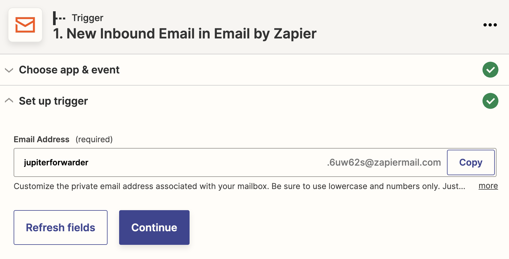
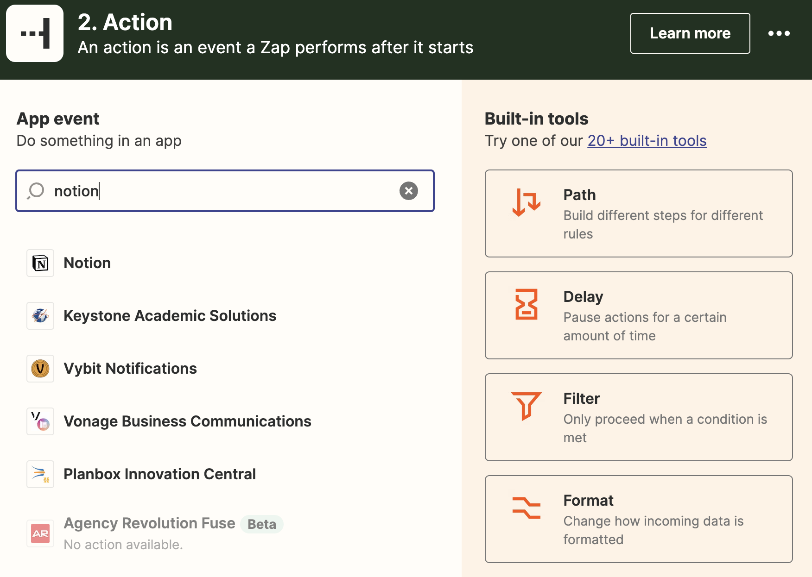
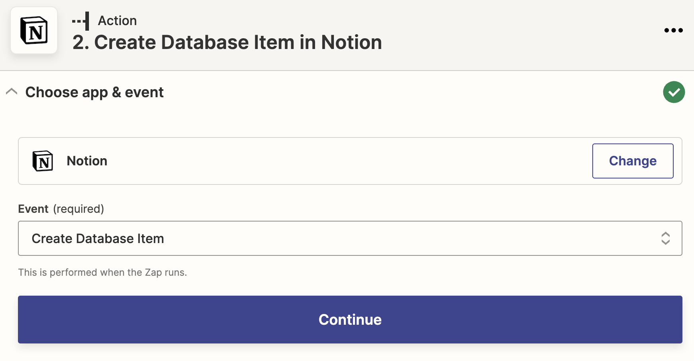
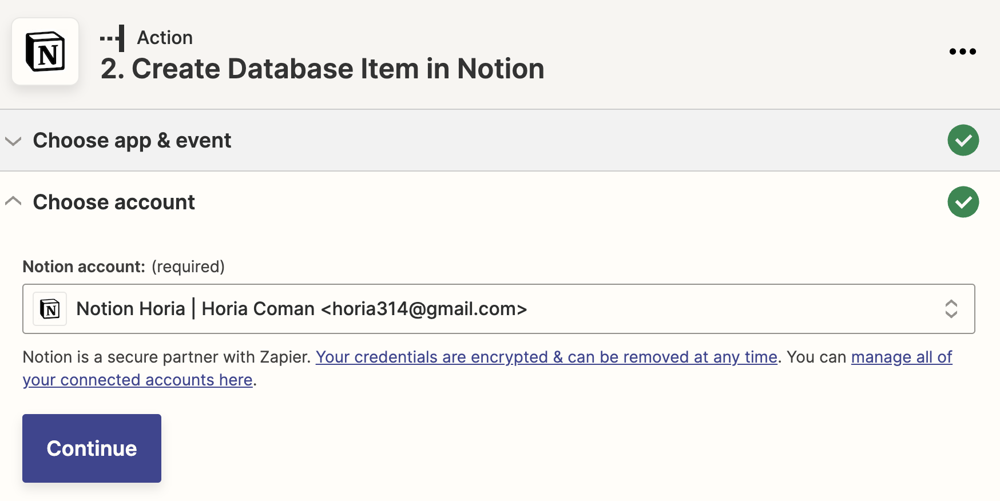
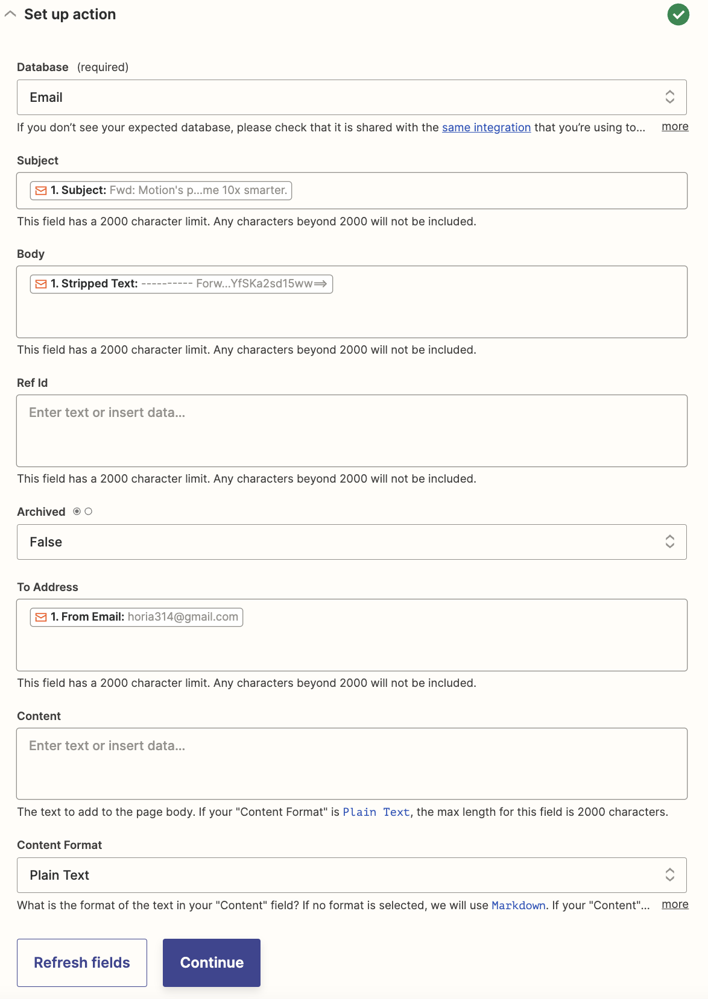

# Use Email As A Source For Inbox Tasks

In order to enable the [email tasks](../concepts/email-tasks.md) [push integration](../concepts/push-integrations.md)
you need to have some sort of external system which handles the processing of email messages into
Notion entities.

[Zapier](https://zapier.com) is one such system. In this "How To" you'll learn how to setup the email to Zapier to
Notion integration.

## Setting Up A Zapier Push Email

We'll assume you already have a Zapier account.

You need to create a Zapier "zap" which will publish a message with a particular
format to the `Push Integrations > Email` Notion database whenever you forward
an email to a special email inbox.

The first step is to create a zap triggered by receiving an email.

After this you need to select the `New Inbound Email` event.

You then need to create a special forwarding email address mentioned above. This
is the address where the emails you want to become tasks will need to be sent to.

You'll be asked to test the Zap and hopefully everything goes well.

This concludes setting up the first step, which is all about Email. The second
step is about Notion, so it starts just so.

You then need to configure the step such that it will perform a `Create Database Item`
for each message.

You again need to choose an account. Notion in general binds these sorts of integrations
not just with a user, but with a particular page that Zapier will have access too. When
configuring things you need to allow it access to the _root page_ of your
[workspace](../concepts/workspaces.md).

This next stage is the most critical. It configures how the fields of the Email
message map onto the Notion database structure. Set things up as follows:

This should be it! You can test and then activate the zap.

Don't forget to `sync` and `gen` to actually see inbox tasks generated from these!

## Future Steps

The above setup hopefully gives you a taste for what can work here. But there's no
magic involved. And Jupiter doesn't really know about email. So whatever can write
things to the Notion database in the appropriate format can work as a source of
email tasks.
