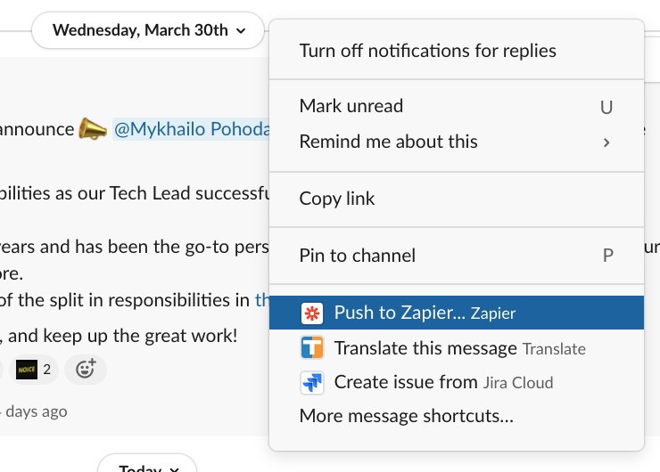
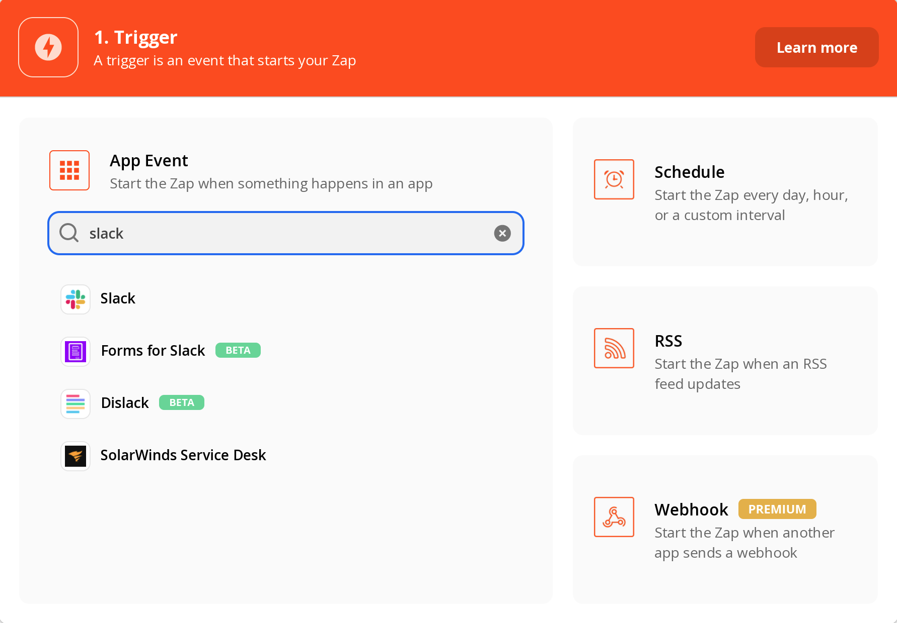
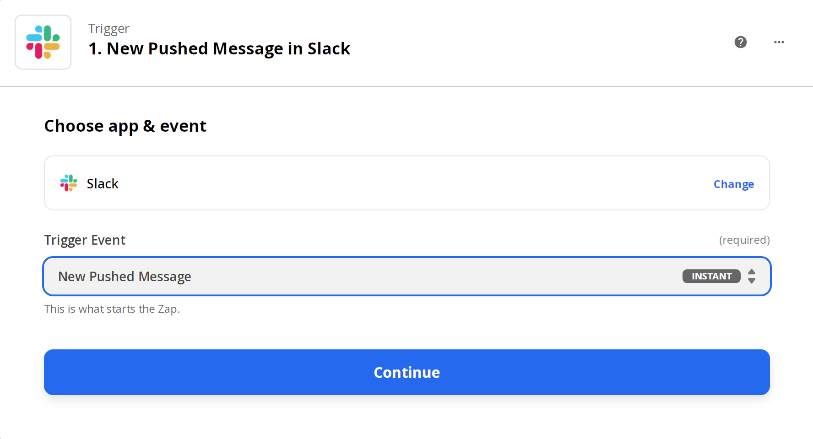
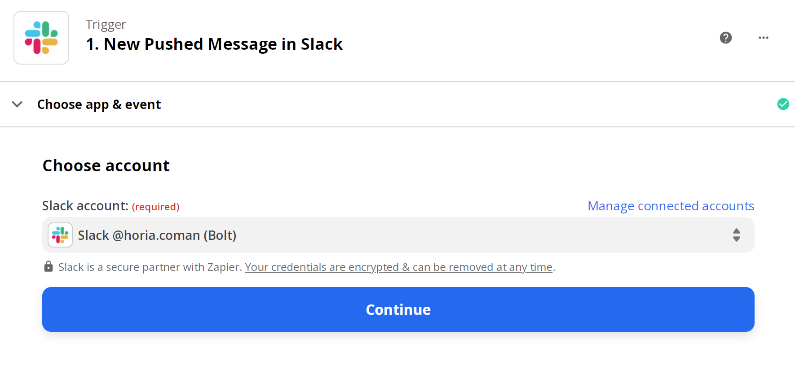
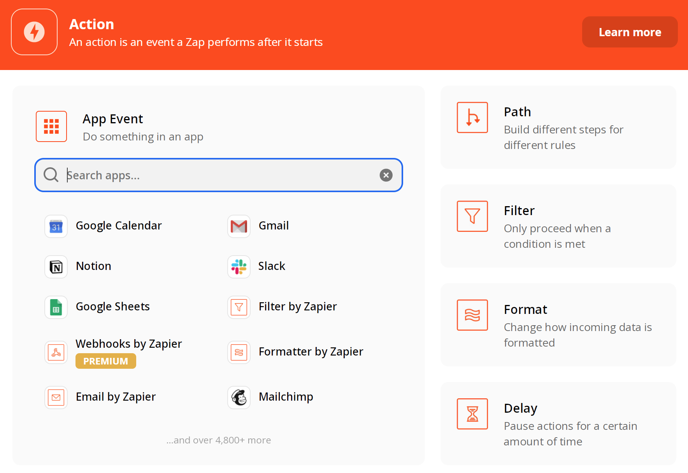
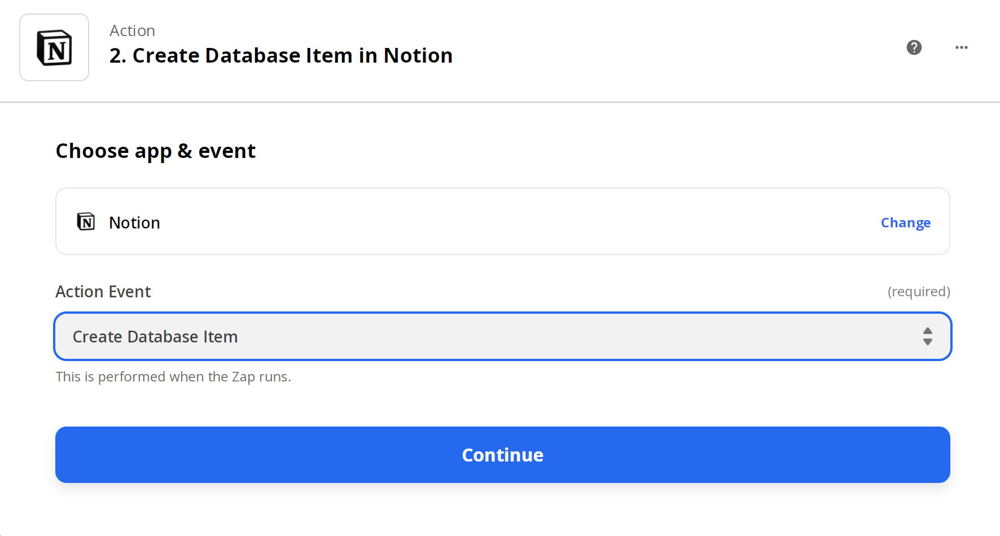
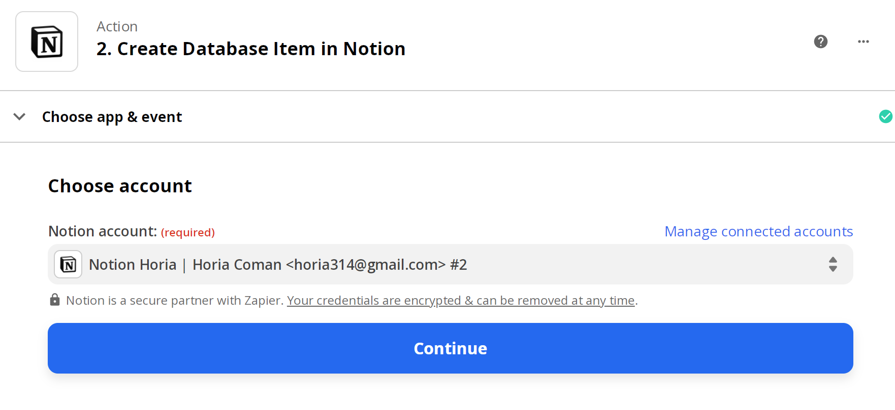
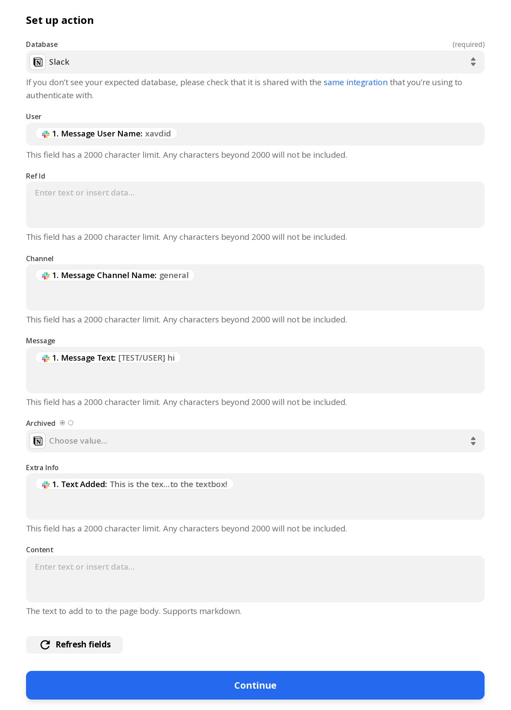

# Use Slack As A Source For Inbox Tasks

In order to enable the [Slack tasks](../concepts/slack-tasks.md) [push integration](../concepts/push-integrations.md)
you need to have some sort of external system which handles the processing of Slack messages into
Notion entities.

[Zapier](https://zapier.com) is one such system. In this "How To" you'll learn how to setup the Slack to Zapier to
Notion integration.

## Setting Things Up Via The `Push To Slack` Action

We'll assume you already have a Slack account, which your IT department has configured such that it integrates with
Zapier. This in turn means that you have a [Push to Zapier](https://zapier.com/blog/updates/1969/zapier-slack-action)
action.

You will, of course, need a Zapier account. But it seems it doesn't need to be the *corporate* one. Your personal
one will do.

The gist of what you then need to do is to create a Zapier "zap" which will publish a message
with a particular format to th `Push Integrations > Slack` Notion database whenever the `Push to Zapier`
action is invoked.

The first step is to create a zap triggered by Slack.

After this you need to select the `New Pushed Message` event.

You then need to select a particular Slack account.

You'll be asked to test the Zap and hopefully everything goes well.

This concludes setting up the first step, which is all about Slack. The second
step is about Notion, so it starts just so.

You then need to configure the step so it will `Create Database Item` for each
message.

You again need to choose an account. Notion in general binds these sorts of integrations
not just with a user, but with a particular page that Zapier will have access too. When
configuring things you need to allow it access to the _root page_ of your
[workspace](../concepts/workspaces.md).

This next stage is the most critical. It configures how the fields of the Slack
message map onto the Notion database structure. Set things up as follows:

This should be it! You can test and then activate the zap.

Don't forget to `sync` and `gen` to actually see inbox tasks generated from these!

## Future Steps

The above setup hopefully gives you a taste for what can work here. But there's no
magic involved. And Jupiter doesn't really know about Slack. So whatever can write
things to the Notion database in the appropriate format can work as a source of
Slack tasks.

Similarly you can do:

* Create one via a Zapier search for particular types of messages. Ones containing certain keywords,
  or coming from certain users or bots, or on certain channels.
* Create one from a totally different tool like Microsft Teams, Google Meet, and even Facebook
  Messanger.
