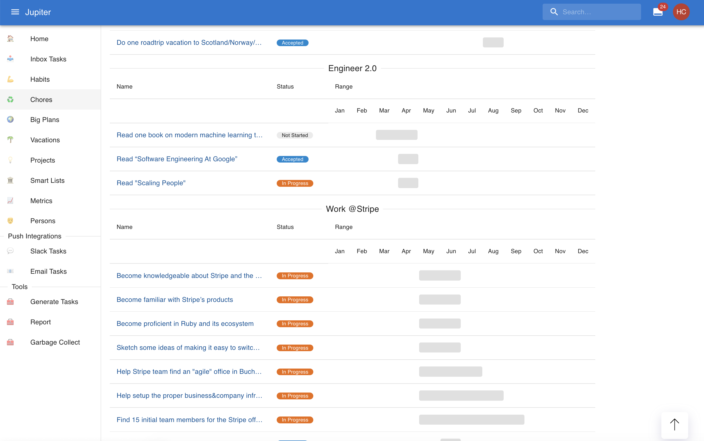

# Jupiter

## About

Jupiter is a tool for _life planning_. It provides goals management, task tracking, work planning,
habit building, a journal, chores management, lists, metrics, a personal relationship manager, and
much more all in a unified package.

I built it to [solve an issue I had](http://www.paulgraham.com/organic.html) - making sure everything
I wanted to get done actually got done, while juggling the standard complexities of life - family, kids, career, etc.

Inspiration comes from [Getting Things Done](https://gettingthingsdone.com/what-is-gtd/),
[The Deep Life Stack](https://www.thedeeplife.com/podcasts/episodes/ep-252-the-deep-life-stack/),
existentialist philosophy, [Notion](notion.so), and many others.

The current version is both a [webapp](https://jupiter-webui.onrender.com/) and a
[CLI application](how-tos/install.md).

Here's a picture from the "inbox" view:

And another mobile friendly view:

And here's one for the "big plans timeline" view:

## Further Reading

Follow the [tutorial](tutorial.md) or [concepts](concepts/overview.md) to get a feeling for what Jupiter can do.