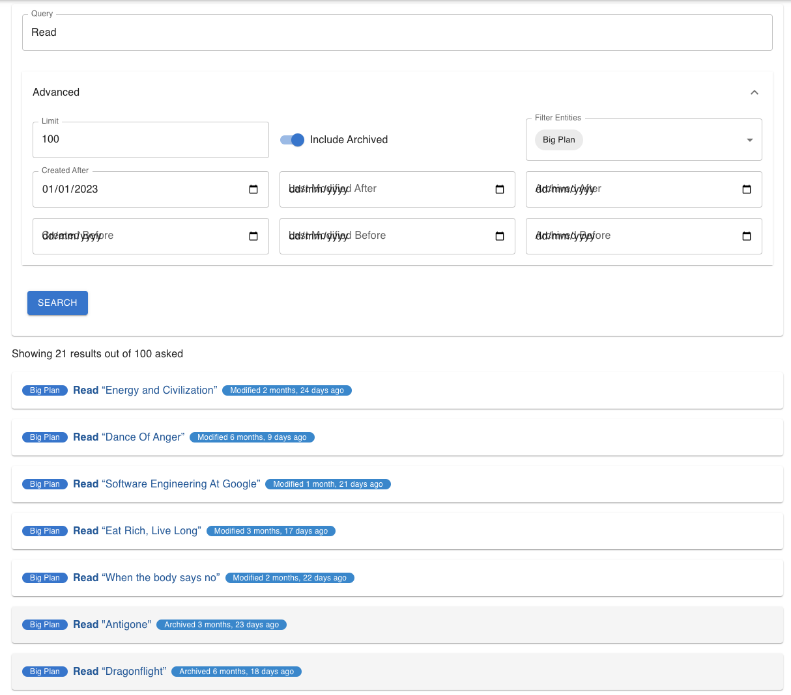
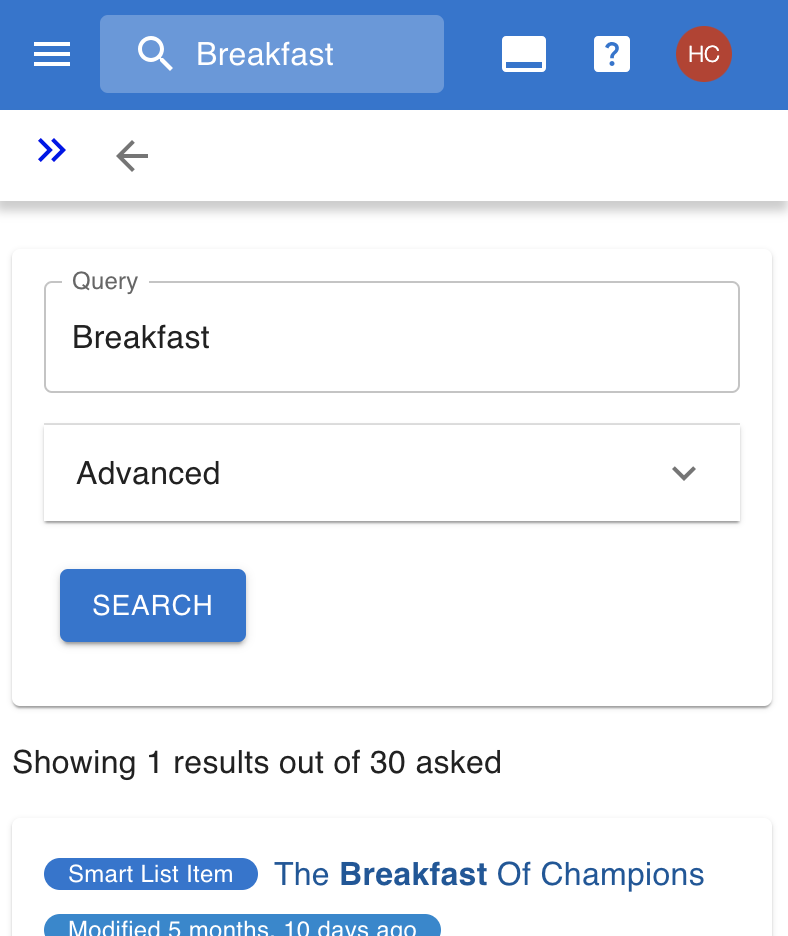

# Search

Jupiter has a generic search functionality. You can use it to quickly jump to
a given entity.

The webui has a special search page accessible under `Tools`:

But you can also invoke quick search at any time:

A CLI command also exists invoked via `jupiter search`.

Both forms offer equivalent functionality, which is:

* Searching by name through all available entities (inbox tasks, vacations, etc).
* Looking through archived entities, or just specific types of entities.
* Filtering based on creation time, last modification time, or archival time.
