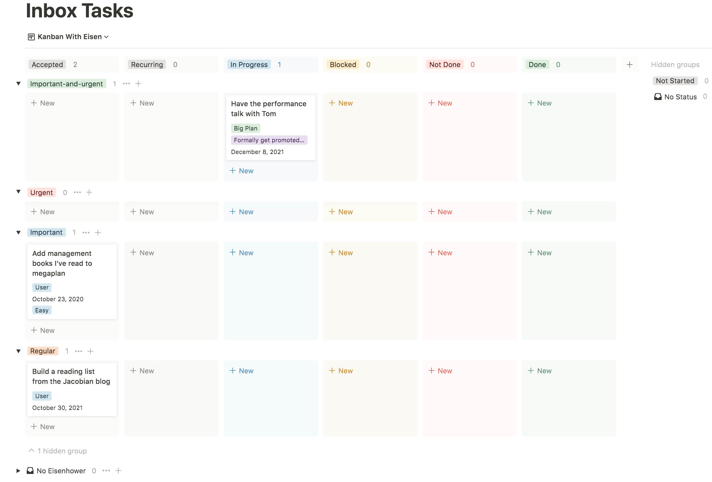
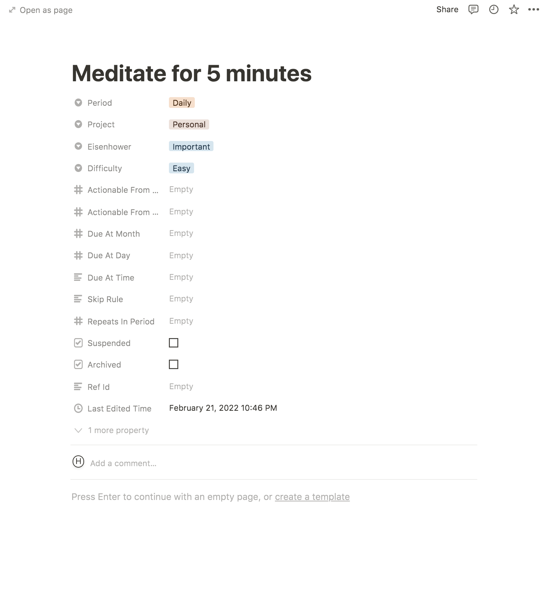
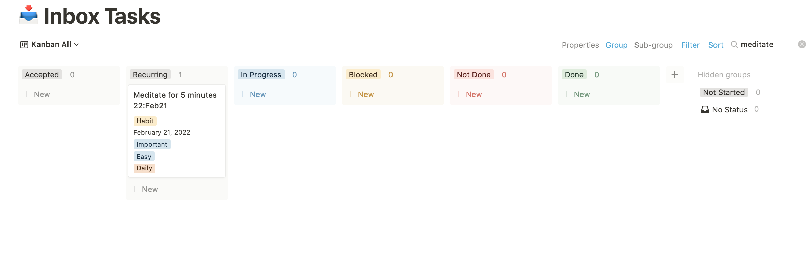

# Tutorial

## Installation

Finally, follow the [installation instructions](install.md) to get
the Jupiter scripts locally. I'll assume you did the Docker installation presented there.

## Prerequisites

To startup, you'll need a Notion account. It's free to setup, but you'll eventually need to sign up for the paid
version if you want to use it properly. The first four months are free however, so you'll get a good feel for whether
it's useful for you or not.

Once that's done, you'll need two crucial pieces of information - your space id, and a token for accessing the API.
In order to do this, you'll need to:

1. Go over to [notion.so](https://www.notion.so/) - the website. You should be seeing your space and anything you've
   setup there manually.
1. Open your browser's inspector. Refresh the page and wait for things to calm down.
1. Find the `/getPublicPageData` API call on the _Network_ tab.
1. The response for this will be a JSON object with a `spaceId` property. That's your space's id. Write it down
   somewhere.
1. In the headers field there will be a `cookie` set with the value `token`. That's your token for accessing the API.
   Write it down somewhere.

The painful part should have passed. You're ready for the proper part.

You'll also need a timezone in the `Continent/City` format, like those provided by the
[tz database](https://en.wikipedia.org/wiki/List_of_tz_database_time_zones). This needs to be specified at the start,
and is used to properly configure task deadlines, etc.

## Create A Workspace

The _workspace_ is where all your work in Jupiter happens. You'll need to create one.

Go over and create a directory somewhere on your local machine. It's a good idea to have this be managed by Git.
Up to you though here - Dropbox, Google Drive, etc. or just regular storage on your machine might be enough. It
should look something like this:

```bash
$ mkdir my-workspaces
$ cd my-workspace
$ git init
$ docker run \
    -it --rm --name jupiter-app -v $(pwd):/data \
    horia141/jupiter:latest init \
    --name "All Work" \
    --timezone "YOUR_TIMEZONE_HERE" \
    --notion-space-id="YOUR_SPACE_ID_HERE" \
    --notion-token="YOUR_TOKEN_HERE" \
    --projet-key="INITIAL_PROJECT_KEY" \
    --project-name="INITIAL_PROJECT_NAME"
$ git add . # Adds everything in the directory
$ git commit -a -m "Initial commit"
```

You should now see a folder named `All Work` in your Notion.so space. This is the Notion representation of the workspace
and it's here where you'll  be doing most of the interacting with Jupiter. You also specified an initial
[project](concepts/projects.md) key and name. Projects are large-scale containers for your work. Most of the times you
can get by with the initial and default one, but sometimes you might want to separate your work.


## Create An Inbox Task

The main work item in Jupiter is the _task_. It can represent anything from planning a vacation to paying a bill.

Tasks reside in the inbox! Much like emails. Many things can place tasks there, including [habits](./concepts/habits.md)
or [chores](./concepts/chores.md) or [birthdays](./concepts/persons.md).

An inbox looks something like this:


Or, if you want to breakdown tasks by their Eisenhower status, something like this:



## Create A Habit

In this section you'll create a habit and generate instances of it corresponding to various times in the inbox.

To start go to the "Habits" view and add a new daily habit called named "Meditate for 5 minutes". You need
to click the "New" button, or the "+" button under the "Daily" column. Complete the habit as follows:



Notice that "Period" is set to "Daily" (one of five valid choices). As expected this determines the "periodicity"
of the habit, or _when_ a new task will appear in the Inbox. For the daily choice, you'll get one
"Meditate for 5 minutes" task every day.

Before we move on to generation, you need to synchronise Notion with the local state by running a `sync` command.
This is needed because (at this moment), there's no way for Jupiter to know about changes that happen in Notion
automatically. So you have to instruct it like so:

```bash
$ docker run \
    -it --rm --name jupiter-app -v $(pwd):/data \
    horia141/jupiter:latest sync
[ Some output here ]
$ git add .
$ git commit -a -m "Synced some remote tasks"
$ docker run \
    -it --rm --name jupiter-app -v $(pwd):/data \
    horia141/jupiter:latest habit-show
[ Some output here ]:
Habits:
  id=0 Medidate for 5 minutes period=monthly
```

> **Note**: the above can just as easily be done via the `habit-create` command. You won't have to run
> a separate sync step there, as the command will take care of creating the tasks on Notion side for you.

To generate the tasks, you can run:

```bash
$ docker run \
    -it --rm --name jupiter-app -v $(pwd):/data \
    horia141/jupiter:latest gen
[ Some output here ]
```

This will leave the inbox looking like:



You can set another date to run the generation for, like so:

```bash
$ docker run \
    -it --rm --name jupiter-app -v $(pwd):/data \
    horia141/jupiter:latest gen \
    --date=2022-02-22
[ Some output here ]
```

And get a final output of the sort:


## Conclusion

This concludes this short introduction to Jupiter.

There's a lot more you can do with it, though. Checkout [concepts](concepts/overview.md) and [how-tos](how-tos) for
 more in depth information.
