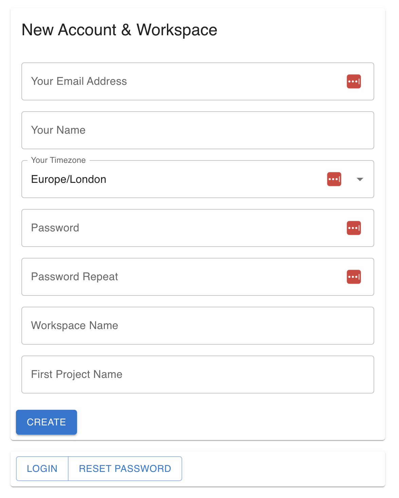
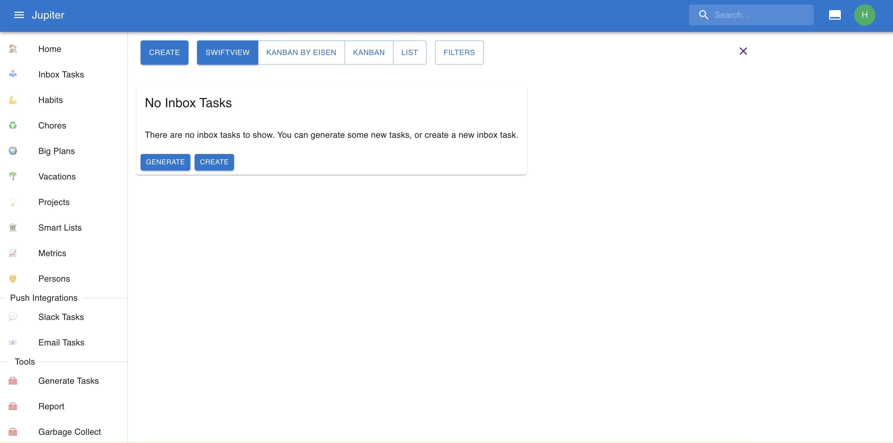
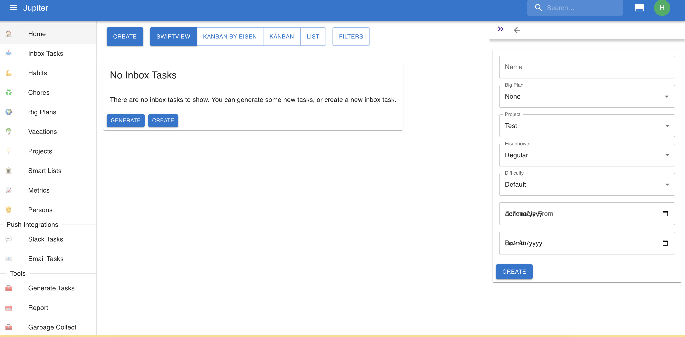
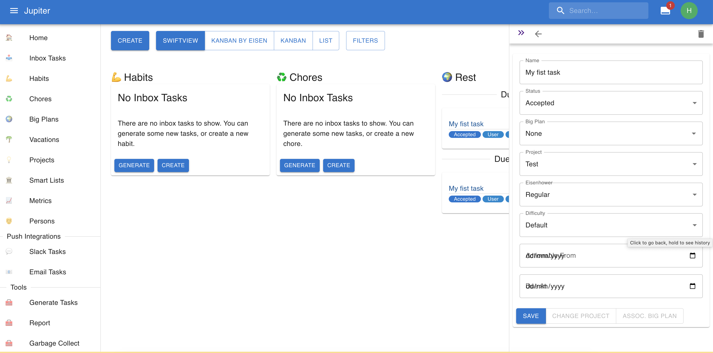
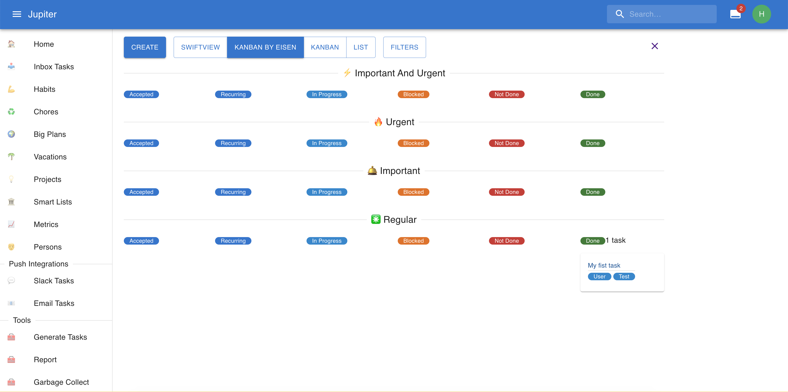

# Tutorial

## Access

First, go to the [Jupiter](https://jupiter-webui.onrender.com). This is the _hosted_ version
of Jupiter, which is the recommended way to start. If you're looking for a _local_ install,
then checkout [installation instructions](how-tos/install.md). Everything below should work the same.

## Create A Workspace

The _workspace_ is where all your work in Jupiter happens. You'll first need to create one.

On accessing Jupiter you should just see a basic button which you _need to click_.

You'll see a login form. You need to press `New Workspace` and you'll be prompted with the following:

Besides the standard fields that identify you and help keep your accunt secure, you will need to
provide a workspace name and initial [project](concepts/projects.md) name.

Press `Create` and you will be shown an [account recovery token](how-tos/recover-your-account.md) that
you need to store in a safe space. Once you do that, you can proceed to _your newly created workspace_.

This will be empty:

## Create An Inbox Task

Let's create an inbox task. Press `Create` and you'll be prompted with something like this:

Name the task `My fist task` and press `Create`. Things should look like this now:

Switch over to the `Kanban By Eisen` view and drag and drop the task to the `Done` column. Things should
look like this now:

## Congrats

Congrats! You created your workspace and performed your first task on Jupiter. It's a big achievement!

You are now equiped with this fundamental knowledge. Now you can play around, or read the various parts
of this guide to get yourself familiarized with the possibilities. Checkout [concepts](concepts/overview.md)
and [how-tos](how-tos) for this more in depth information.

Welcome to Jupiter and happy planning!
