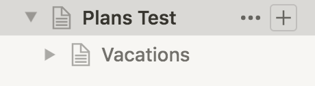
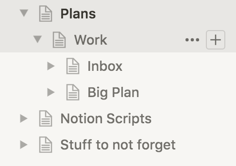
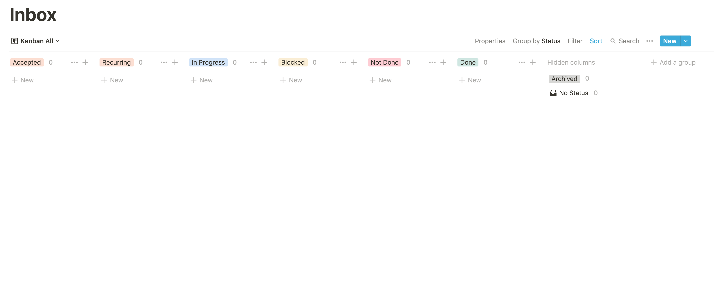
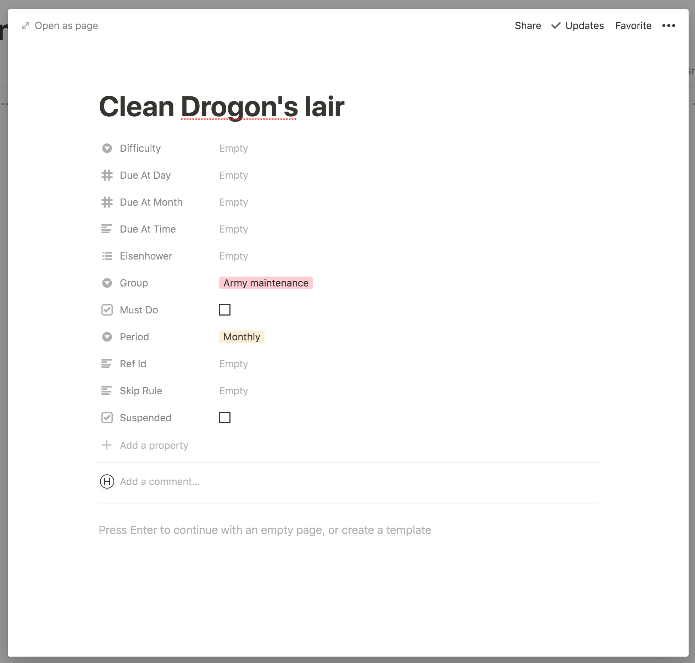
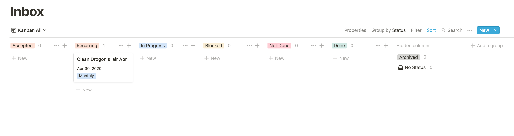
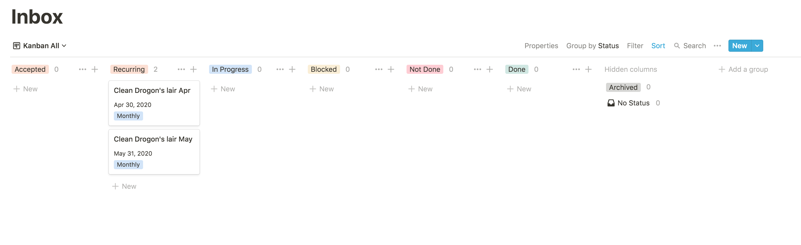

# Tutorial

## Installation

Finally, follow the [installation instructions](https://github.com/horia141/jupiter/blob/master/docs/install.md) to get
the Jupiter scripts locally. I'll assume you did the Docker installation presented there.

## Prerequisites

To startup, you'll need a Notion account. It's free to setup, but you'll eventually need to sign up for the paid
version if you want to use it properly. The first four months are free however, so you'll get a good feel for wether
it's useful for you or not.

Once that's done, you'll need two crucial pieces of information - your space id, and a token for accessing the API.
In order to do this, you'll need to:

1. Go over to [notion.so](https://www.notion.so/) - the website. You should be seeing your space and anything you've
   setup there manually.
1. Open your browser's inspector. Refresh the page and wait for things to calm down.
1. Find the `/getPublicPageData` API call on the _Network_ tab.
1. The response for this will be a JSON object with a `spaceId` property. That's your space's id. Write it down
   somewhere.
1. In the headers field there will be a `cookie` set with the value `token`. That's your token for accessing the API.
   Write it down somewhere.

The painful part should have passed. You're ready for the proper part.

## Creating A Workspace

The _workspace_ is where all your work in Jupiter happens. You'll need to create one.

Go over and create a directory somewhere on your local machine. It's a good idea to have this be managed by git too.
Up to you though here - Dropbox, Google Drive, etc. or just regular storage on your machine might be enough. It
should look something like this:

```bash
$ mkdir my-workspaces
$ cd my-workspace
$ git init
$ docker run \
    -it --rm --name jupiter-app -v $(pwd):/data --env TZ=Europe/Bucharest \
    horia141/jupiter:latest ws-init \
    --name "Plans" \
    --space-id="YOUR_SPACE_ID_HERE" \
    --token="YOUR_TOKEN_HERE"
$ git add . # Adds everything in the directory
$ git commit -a -m "Initial commit"
```

You should now see a folder named `Plans` in your Notion.so space. This is the Notion representation of the workspace
and it's here where you'll  be doing most of the interacting with Jupiter.



## Create A Project

Work in Jupiter is organised around projects. These contain an "Inbox", which is where your day-to-day tasks live. Both
the ones you create and the ones the system creates. This is essentially a Trello/Jira like board, with some fancier
capabilities. Then there are "Recurring Tasks", which are templates for tasks that occur periodically - daily, weekly,
monthly, quarterly, or yearly. Think chores and habits. Finally there are "Big Plans", which are longer-term projects,
usually taking 1-6 months. They're made up of tasks too, and these tasks will appear in the Inbox too. There's
more to say here, but as always, check the docs.

To create a project you need to run the `project-create` command, like so:

```bash
$ docker run \
    -it --rm --name jupiter-app -v $(pwd):/data --env TZ=Europe/Bucharest \
    horia141/jupiter:latest project-create \
        my-work \
        --name "My Work"
[ Some output here ]
$ git add .
$ git commit -a -m "Created project 'My Work'"
```

The first argument is a "project key", which must be unique to your workspace and which will be used to reference the
project later. This will create a bunch of structures in Notion under your plan, looking like so:



The inbox at this point will look something like this:



So it's basically a blank canvas waiting for your work. The recurring task view and the big plans view will
look the same.

## Create A Recurring Task

In this section you'll create a recurring task and generate instances of it corresponding to various times in the inbox.

To start go to the "Recurring Tasks" view and add a new recurring monthly task named "Clean Drogon's lair". You need
to click the "New" button, or the "+" button under the "Monthly" column. Complete the task as follows:



Notice that "Period" is set to "Monthly" (one of five valid choices) and group is set to "Army maintenance" (which
is essentially a free-form label). The former determines the periodicity of the task, while the other helps with
organising work.

Before we move on to generation, you need to synchronise Notion with the local state by running a `sync` command.
This is needed because (at this moment), there's no way for Jupiter to know about changes that happen in Notion
automatically. So you have to instruct it like so:

```bash
$ docker run \
    -it --rm --name jupiter-app -v $(pwd):/data --env TZ=Europe/Bucharest \
    horia141/jupiter:latest recurring-tasks-sync \
    --project my-work
[ Some output here ]
$ git add .
$ git commit -a -m "Synced some remote tasks"
$ docker run \
    -it --rm --name jupiter-app -v $(pwd):/data --env TZ=Europe/Bucharest \
    horia141/jupiter:latest recurring-tasks-show \
    --project my-work
[ Some output here ]
Army maintenance:
  id=0 Clean Drogon's lair period=monthly group=Army maintenance
$ docker run \
    -it --rm --name jupiter-app -v $(pwd):/data --env TZ=Europe/Bucharest \
    horia141/jupiter:latest recurring-tasks-show \
    --project my-work \
    --id 0
[ Some output here ]
id=10 Clean Drogon's lair period=monthly group="Army maintenance"
    eisen="" difficulty=none skip_rule=none suspended=False must_do=False
    due_at_time=none due_at_day=none due_at_month=none
```

> **Note**: the above can just as easily be done via the `recurring-tasks-create` command. You won't have to run
> a separate sync step there, as the command will take care of creating the tasks on Notion side for you.

To generate the tasks, you can run:

```bash
$ docker run \
    -it --rm --name jupiter-app -v $(pwd):/data --env TZ=Europe/Bucharest \
    horia141/jupiter:latest recurring-tasks-gen \
    my-work
[ Some output here ]
```

This will leave the inbox looking like:



You can set another date to run the generation for, like so:

```bash
$ docker run \
    -it --rm --name jupiter-app -v $(pwd):/data --env TZ=Europe/Bucharest \
    horia141/jupiter:latest recurring-tasks-gen \
    my-work \
    --date=2020-05-01
[ Some output here ]
```

And get a final output of the sort:



## Conclusion

This concludes this short introduction to Jupiter.

There's a lot more you can do with it, though. Checkout [concepts](concepts.md) and [how-tos](how-tos) for more in
depth information.