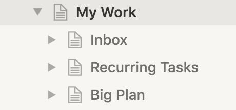

# Tutorial

## Installation

Finally, follow the [installation instructions](https://github.com/horia141/jupiter/blob/master/docs/install.md) to get
the Jupiter scripts locally. I'll assume you did the Docker installation presented there.

## Prerequisites

To startup, you'll need a Notion account. It's free to setup, but you'll eventually need to sign up for the paid
version if you want to use it properly. The first four months are free however, so you'll get a good feel for wether
it's useful for you or not.

Once that's done, you'll need two crucial pieces of information - your space id, and a token for accessing the API.
In order to do this, you'll need to:

1. Go over to [notion.so](https://www.notion.so/) - the website. You should be seeing your space and anything you've
   setup there manually.
1. Open your browser's inspector. Refresh the page and wait for things to calm down.
1. Find the `/getPublicPageData` API call on the _Network_ tab.
1. The response for this will be a JSON object with a `spaceId` property. That's your space's id. Write it down
   somewhere.
1. In the headers field there will be a `cookie` set with the value `token`. That's your token for accessing the API.
   Write it down somewhere.

The painful part should have passed. You're ready for the proper part.

## Creating A Workspace

The _workspace_ is where all your work in Jupiter happens. You'll need to create one.

Go over and create a directory somewhere on your local machine. It's a good idea to have this be managed by git too.
Up to you though here - Dropbox, Google Drive, etc. or just regular storage on your machine might be enough. It
should look something like this:

```bash
$ mkdir my-workspaces
$ cd my-workspace
$ git init
$ docker run \
    -it --rm --name jupiter-app -v $(pwd):/data --env TZ=Europe/Bucharest \
    horia141/jupiter:latest ws-init \
    --name "Plans" \
    --space-id="YOUR_SPACE_ID_HERE" \
    --token="YOUR_TOKEN_HERE"
$ git add . # Adds everything in the directory
$ git commit -a -m "Initial commit"
```

You should now see a folder named `Plans` in your Notion.so space. This is the Notion representation of the workspace
and it's here where you'll  be doing most of the interacting with Jupiter.


## Create A Project

Work in Jupiter is organised around projects. These contain an "Inbox", which is where your day-to-day tasks live. Both
the ones you create and the ones the system creates. This is essentially a Trello/Jira like board, with some fancier
capabilities. Then there are "Big Plans", which are longer-term projects, usually taking 1-6 months. They're made up of
tasks too, and these tasks will appear in the Inbox too. There's more to say here, but as always, check the docs.

To create a project, you need to first create a file called `tasks-works.yaml` in your workspace dir. The name is
arbitrary actually, and you can name it whatever and have however many of them. This file should look like this:

```yaml
name: "Work"
key: work

groups:
  ceremony:
    format: "{name}"
    tasks:
      - name: Send weekly newhires email
        period: weekly
      - name: Send news digest
        period: daily
  research:
    format: "{name}"
    tasks:
      - name: Read industry-site.com for latest news
        period: monthly
```

There's a bunch of metadata at the top, of which `key` is the most important. Never change this once you've set it,
because it'll de-associate the file here from the Notion.so boards. The `groups` structure contains all the recurring
tasks the system will manage. Hopefully its format is self-explanatory.

To create the project use:

```bash
$ docker run \
    -it --rm --name jupiter-app -v $(pwd):/data --env TZ=Europe/Bucharest \
    horia141/jupiter:latest create-project \
    /data/tasks-work.yaml
[ Some output here ]
```

This will create a bunch of structures in Notion under your plan, looking like so:



Finally, run the `upsert-tasks` command to actually create some of the recurring tasks:

```bash
$ docker run \
    -it --rm --name jupiter-app -v $(pwd):/data --env TZ=Europe/Bucharest \
    horia141/jupiter:latest upsert-tasks \
    /data/tasks-work.yaml
[ Some output here ]
```

This will leave the inbox looking like:


There's a bunch more to explore, like big plans, various recurring options, vacations, task archival and removal, but
head on over to the [docs](https://jupiter-goals.readthedocs.io/en/stable/) for those.

In the end, if you've used git, you should run the following to save the work:

```bash
$ git add tasks-work.yaml
$ git add .system.lock
$ git commit -a -m "Setup some initial structures"
```
