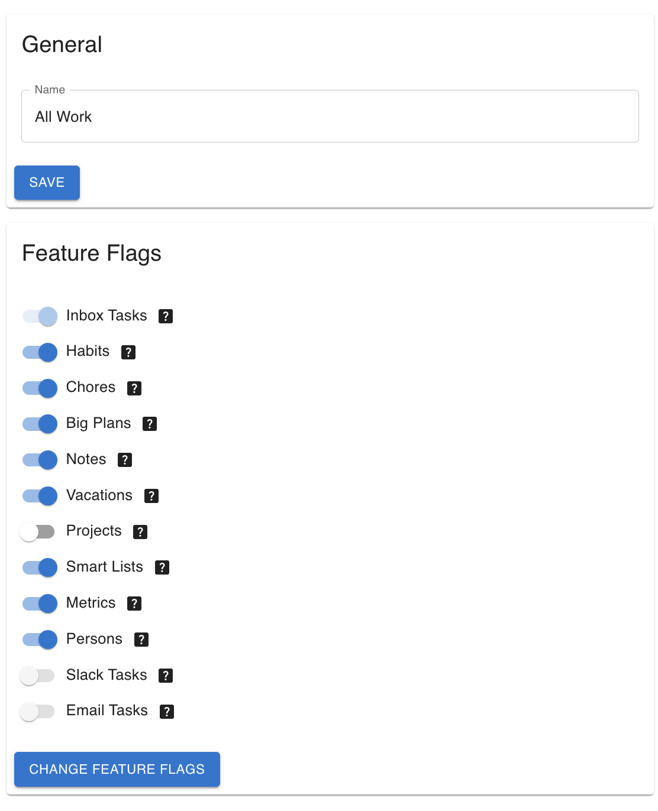

# Feature Flags

Thrive can be quite overwhealming with its feature set and the various interaction modes between
each feature. At the same time, not everyone needs everything from the tool. Some might use it
primarily for short term work, others to plan out their life, while still others might focus on
tracking and recording things.

To account for this, the feature set visible for a user in workspace can be configured.
Thus you can customize your Thrive experience, and keep only the features you need.
And of course, you can add and remove features at any time.

Indeed, **the backing data is never lost**. If you disable a feature, then all its associated data
and the various UIs and commands are hidden. When you re-enable it, you'll see the data again.

Conversely, no new data is generated via such processes as [generation](tasks-generation.md) or
[gamification](gamification.md). Nor is data modified via other processes like [garbage collection](garbage-collection.md).

## User Feature Flags

In the Web UI user-level flags live under `Account` and currently look like:

In the CLI you can view the user feature flags with `user-show` and change them via
`user-change-feature-flags`.

## Workspace Feature Flags

In the Web UI workspace-level feature flags live under `Settings` and currently looks like:

In the CLI you can view the workspace feature flags with `workspace-show` and change them via
`workspace-change-feature-flags`.
