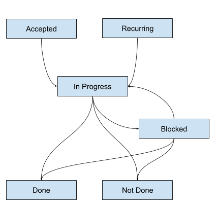
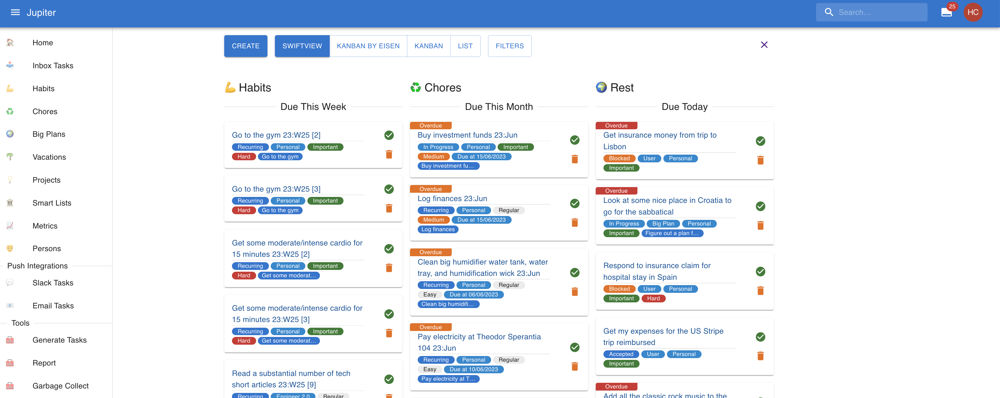
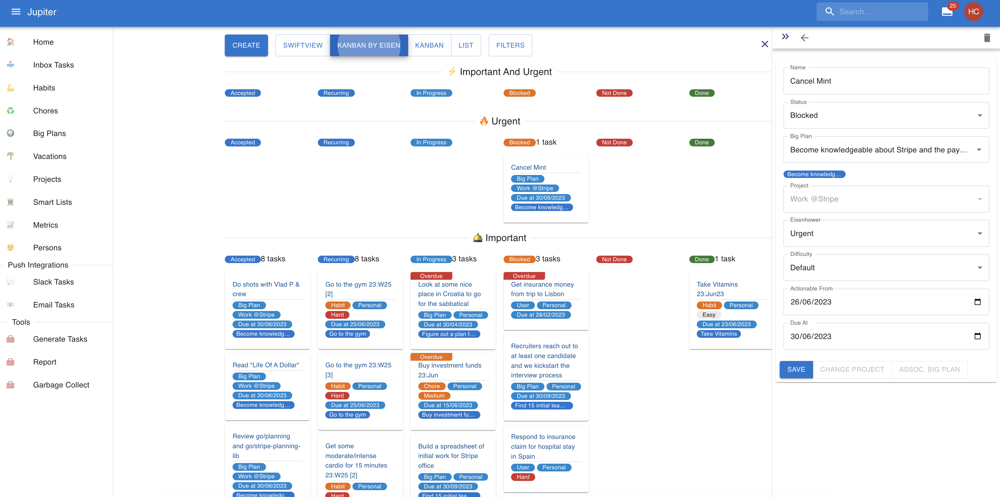

# Inbox Tasks

A task is some atomic unit of work. Tasks live in the “inbox”. A task is ideal
to model work which can be done in anything from a minute to a day (excluding
wait or idle times). They can be created by hand, or automatically as recurring
tasks for a certain period.

For example, you can have a task like "Change AC filter", or "Take visa papers to
embassy", or "Research team off-site locations".

## Properties

Inbox tasks have a _name_, which should tell you what the task is all about.

Tasks have a _status_, which can be one of:

* _Accepted_: all tasks you created by hand should start with this status. It means
  you’re going to start working on the task in the near future.
* _Recurring_: all tasks you created from chores, habits, metrics, persons, etc
  start with this status. It means you’re going to start working on the task in the
  near future.
* _In Progress_: all tasks you’re currently working on should be placed in this
  status. Once you start working on a task you should move it to this status, and
  keep it there until it’s finished or the parts that depend on you are done, and
  you can move in the “Blocked” state.
* _Blocked_: all tasks that are currently handled by _someone else_, and their
  completion is not in your hands. Once your part of the task is done, you should
  move it to the “Blocked” status. It can move back and forth to “In Progress”,
  and then to “Not Done” or “Done”.
* _Done_: all tasks that are finished, with the desired outcome.
* _Not Done_: all tasks that are finished, but not with the desired outcome.
* _Archived_: tasks which have been archived [garbage collection](./garbage-collection.md).
  You can also achieve them via manually changing their status too.
* _No Status_: tasks which you perhaps created, but don’t plan on actioning in any
  way.

Tasks also have a _source_, which can be one of:

* _User_: the task has been generated by the user. It is the default source which is
  inferred if there isn't anything else.
* _Habit_: the task has been generated from a [habit](habits.md).
* _Chore_: the taks has been generated from a [chore](chores.md)
* _Big Plan_: the task belongs to a [big plan](big-plans.md).
* _Metric_: the task has been generated for a particular [metric](metrics.md).
* _Person Catch Up_: the task has been generated as a catch up task for a [person](persons.md).
* _Person Birthday_: the task has been generated as a birthday task for a [person](persons.md).

In the Inbox, you can see tasks in a sort of Kanban board, organised by status like
this:

The state evolution diagram is:

Tasks have an optional _actionable date_. Sometimes, it does not make sense to work
on a task before a certain date. Think paying a bill which will be provided in a week. If a task
has an actionable date, it won't be visible in the boards until a week before it.

Tasks have a deadline. It’s optional, but it’s strongly recommended you add one
as a goal setting rule.

Tasks can also be labeled according to the [Eisenhower matrix](https://www.eisenhower.me/eisenhower-matrix/),
as either _urgent_ or _important_.

Tasks also have a notion of _difficulty_. They can be catalogued as `Easy`, `Medium` or `Hard`. These inform
the way certain views are sorted. But there's no other semantic meaning attached to these categories though.

## The Inbox

The inbox is a representation of your current work, as well as the work you recently
finished or will recently start. It's a collection of tasks organized in a particualr way.

The inbox looks like a Kanban board usually, with the various states of a task as
columns.

There are multiple views for the inbox though right now:

* _Swiftview_: split tasks into three - habits, chores, and others. Tasks are sorted by due date
  and Eisenhower status. Tasks that are completed are not shown. Useful to focus on habits and
  chores, especially in the mobile view.
* _Kanban With Eisen_: views all tasks in the inbox as a Kanban board, split by the Eisenhower status.
  Tasks are sorted by due date.
* _Kanban_: views all tasks in the inbox as a unified Kanban board. Tasks are sorted by due date.
* _List_: views all tasks in the inbox as a long list of work, with limited sorting.

Here’s a sneak peak at some views:

Besides the obvious button interactions, you can also _swipe left_ to mark a task as _done_ and
_swipe right_ to mark it as not done.

## Gamification

Inbox tasks participate in [gamification](gamification.md) if it is enabled. Every task
marked as `Done` brings you number of points. Every task marked as `Not Done` loses you a number
of points. There's a random "Puppy Bonus" from time to time to spice things up.

## Interactions

In the web app you can change the properties of a inbox task by clicking on it in the view.

In the CLI app you can:

* Create a project via `inbox-task-create`.
* Change the name, status, actionable date, due date, eisenhower, difficulty via `inbox-task-update`.
* Change the project via `inbox-task-change-project`.
* Change the big plan via `inbox-task-associate-with-big-plan`.
* See a summary of the projects via `inbox-task-show`.