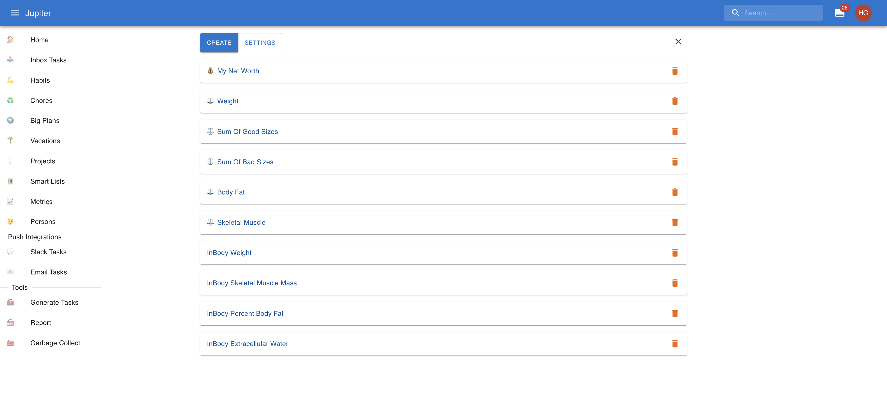
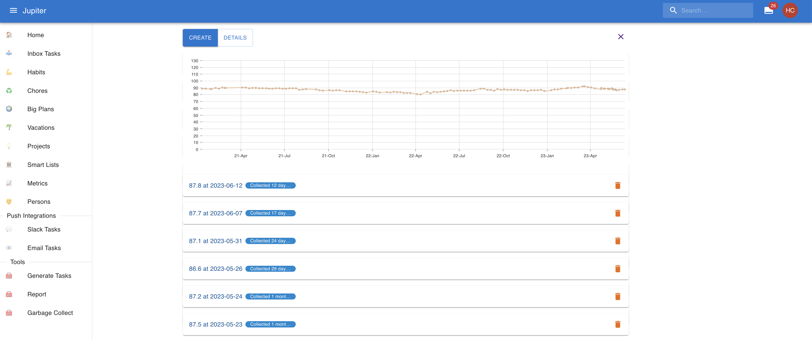
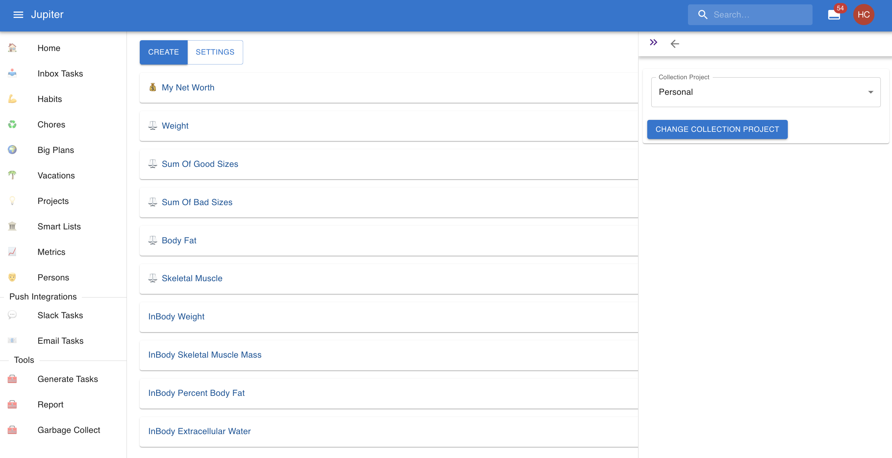
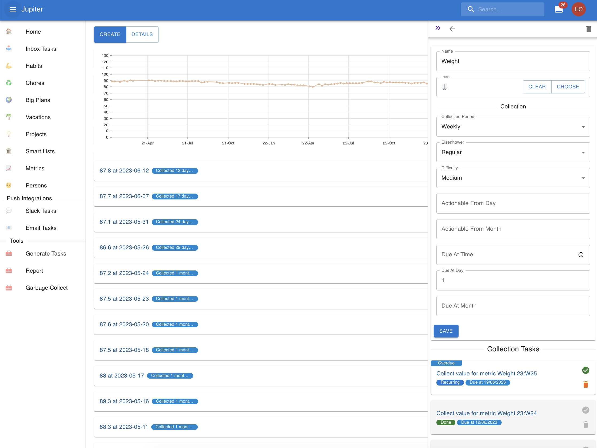
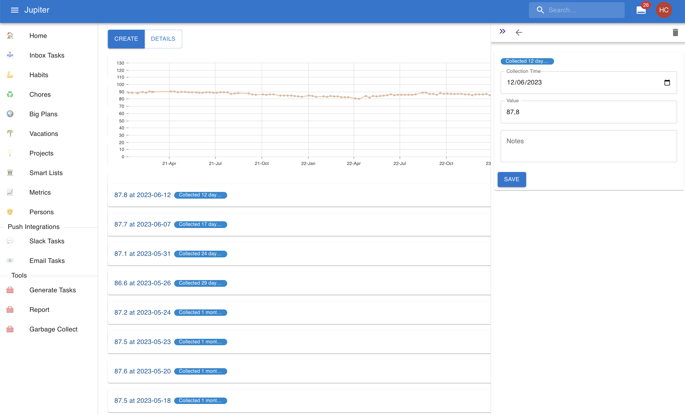

# Metrics

Metrics are a measure of the evolution in time of some aspect of your life. It is often useful to
quantify certain aspects of your life, and keep special tabs on it. Metrics allow you to track
your weight, your retirement savings, days gone to the gym, miles run, etc.

Metric entries are the records of the value of a certain metric at a certain time.

In the workspace overview, you can view the set of metrics:

Each metric contains many entries or records, for example:

## Properties

Metrics have a name. It's the nicely looking counterpart to the key.

Metrics can also have an icon. It's a nice unicode glyph like 💰 or ⚖️ and it serves to
visually distinguish the metric.

Metrics can also have a _unit_. It adds extra info about what exactly you're recording - weight,
currency, the count of an event, etc.

Metrics can have a _collection project_ and _collection period_. It makes sense to record (or collect)
the value of a metric regularly. Think of your weight or the number of kilometers run in a week. To
allow for this, special collection inbox tasks can be generated for the metric, just like a
[habit](habits.md). The collection period will determine how often the task
is generated (weekly, monthly, etc.). The inbox tasks will go to the configured [project](./projects.md)
if it is present, or to the [default workspace one](./workspaces.md) if it is missing. If none
are present, generation will fail. There's also all the other collection parameters (actionable
dates, due dates, Eisenhower statuses, etc).

Metric entries have a _collection time_ - the time they were recorded.

They also have a _value_ - the actual value for the metric at that particular time.

Metric entries can also have some notes attached to them, for any extra info you might want to add.

## Interaction Summary

In the web app you can change the global collection project via the `Settings` button:

And you can change the properties of a metric by clicking on it in the view.

Finally you can change the properties of an entry by clicking on it in the view.

In the CLI app you can:

* Change the collection project via `metric-change-collection-project`.
* Create a metric via `metric-create`.
* Remove a metric via `metric-archive`.
* Change the name, icon, unit, etc via `metric-update`.
* See a summary of the metrics via `metric-show`.
* Create a metric entry via `metric-entry-create`.
* Remove a metric entry via `metric-entry-archive`.
* Change the collection time, value, or not of a metric entry via `metric-entry-update`.
