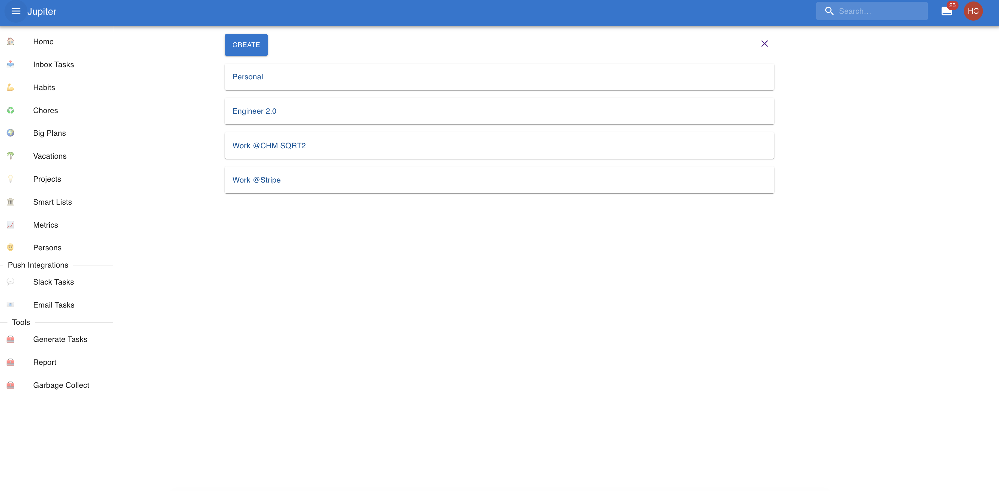
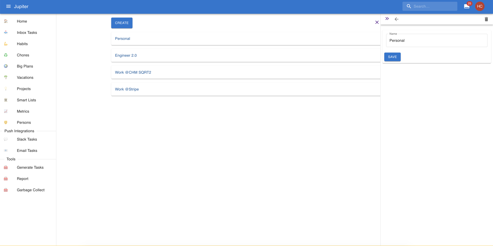

# Projects

A project is a larger and longer-term container for work. Think of it as a _label_
for tasks, habits, chores, or big plans.

For example, you can have a project for your personal goal tracking, and one for
your career goal tracking etc. In most cases just one or two projects are enough,
and they should be very long lived things.

Projects are attached to the workspace. You can see the projects in the `Projects`
left-hand menu tab. An example:

Alternatively you can see projects via `project-show` in the CLI.

## Projects Properties

On their own, projects have a single property - their name.

Projects can be nested within other projects, creating a tree-like structure.

## Projects Interactions Summary

In the web app you can change the properties of a project by clicking on it in the view.

In the CLI app you can:

* Create a project via `projects-create`.
* Change the parent via `projects-change-parent`.
* Change the name via `projects-update`.
* See a summary of the projects via `projects-show`.
