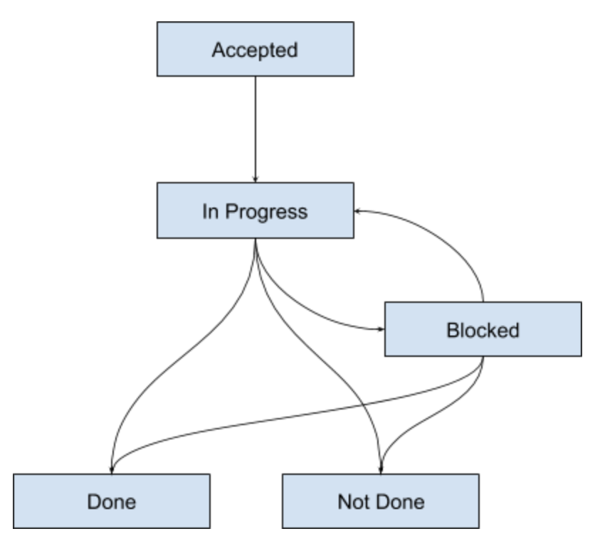

# Big Plans

Big plans are larger units of work. They are made up of multiple tasks. Big plans
live in the "Big Plan page". A big plan is ideal to model work which can be done
in anything from a week to several months, and which consists of multiple steps.

For example, you can have a task like "Plan a family vacation", or "Get a talk
accepted to a conference", or "Buy a new house".

## Properties

Big plans have a _name, which should tell you what the task is all aboutl

Big plans have a _status_, which can be one of:

* _Accepted_: all big plans you create should start with this status. It means you're
  going to start working on this plan in the near to medium future.
* _In Progress_: all big plans you're currently working on should be placed in this
  status. Once you start working on some tasks from the plan, it can be counted as being
  in progress.
* _Blocked_: all big plans that you're currently not able to push through for some reason.
  Either all tasks are blocked, or you can't start on any new ones, etc. It can move back
  and forth to "In Progress", and then to "Not Done" or "Done".
* _Done_: the big plan is finished, with the desired outcome.
* _Not Done_: the big plan is finished, but not with the desired outcome.

In the big plan page, you can see big plans in a sort of timeline board, organised by project.

The state evolution diagram is:

Big plans can be marked as _key big plans_. This is first a user-level concept - it
marks the big plan as an important one for you, that is absolutely necessary to get
right. In various other contexts it applies, helping with sorting, prioritization, etc.

Big plans have an actionable date, much like _inbox tasks_. Conceptually, this is the the
time from which you can start working on a particular big plan.

Big plans also have a deadline. It's optional, but it's strongly recommended you add one
as a goal setting rule.

Any tasks that don't have their own actionable or due dates will inherit them from the big
plan, if it has any.

Between them, the actionable and due dates allow you to schedule the big plans in time in
a more organized manner. There is a special view which allows for this.

## Milestones

Big plans have milestones attached to them. These have a name and a date when they
are recorded (either need to happen, or finish, etc.).

The milestone must occur before the start date and end date of the big plan if
these exist. Once milestones are added, the start and end date can only be added
before the earliest milestone, or after the latest one, respectively.

## Stats

Big plans have a notion of progress associated with them, which is quantified by a number
ranging from `0` to `100`. 

* Big plans that are not started are at `0`.
* Big plans that are in progress or blocked are at `10` at a mimum and `95` at a maximum.
  If there are any inbox tasks associated with the plan, the progress is proportional to the
  number of completed tasks (done or not done) relative to the total number of tasks.
* Big plans that are in a completed state (done or not done) are at `100` progress.

This is a simple indicator of the progress done and yet do be done on a particular
piece of work.

## Big Plans Page

The big plan page is a representation of your current and longer term work. It's a
collection of big plans.

There are multiple views for the big plans though right now:

* _Timeline by project_: organize big plans as a Gantt chart split by project.
* _Timeline_: organize all big plans as a Gnatt chart.
* _List_: view all big plans as a long list of work, with limited sorting.

Besides the obvious button interactions, you can also _swipe left_ to mark a big plan as _done_ and
_swipe right_ to mark it as not done.

## Gamification

Big plans participate in [gamification](gamification.md) if it is enabled. Every plan
marked as `Done` brings you number of points. Every task marked as `Not Done` loses you a number
of points.
