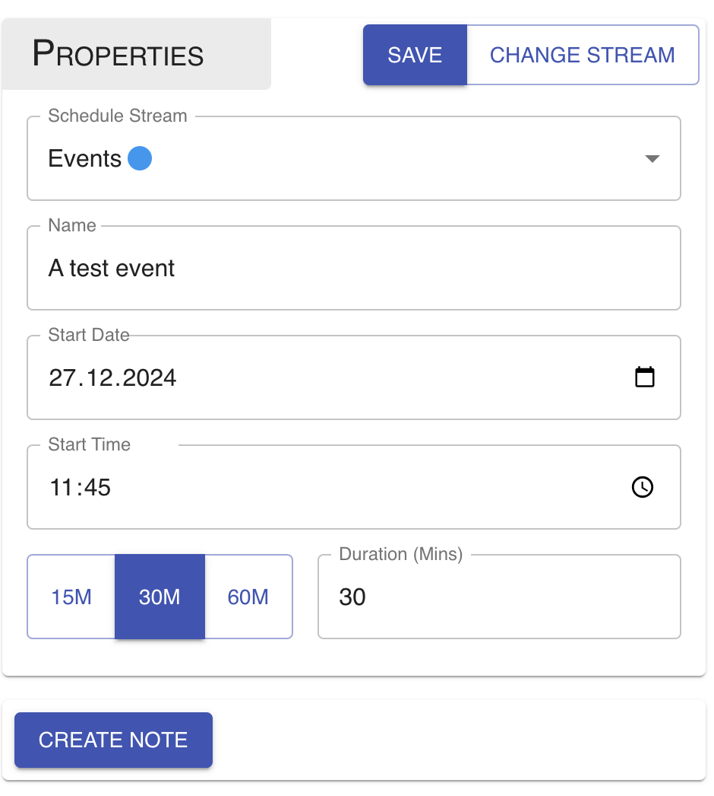
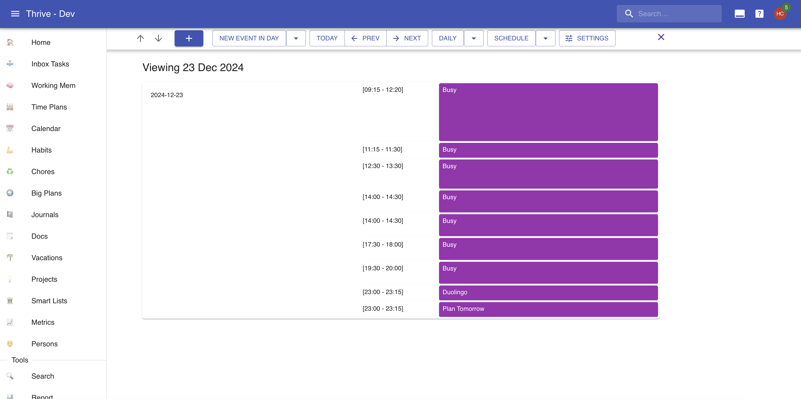
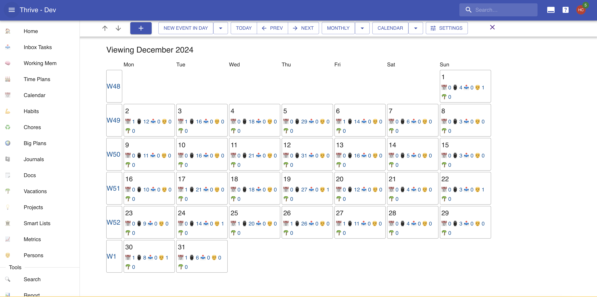
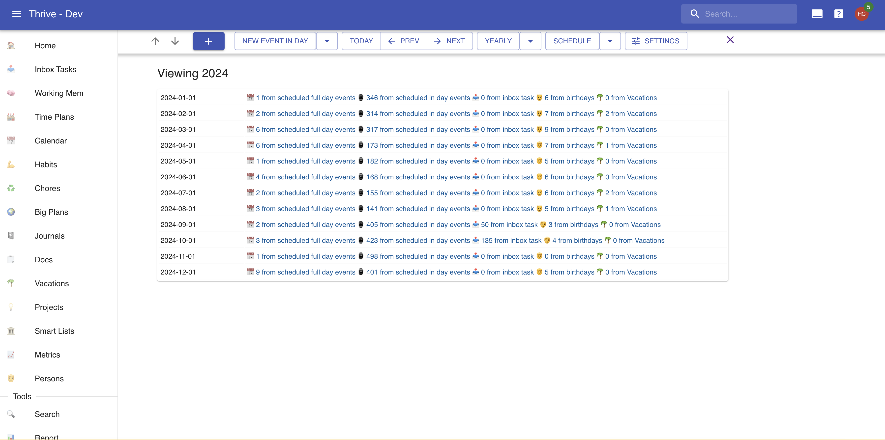

# Calendars

The calendar allows you to plan things in time. And to record events that will happen.
It also allows you to view at a glance how things are arranged in time.

Calendars are populated by _calendar events_, which belong to _calendar streams_.

Here's how a calendar might look like:

## Calendar Events

Calendar events are the atomic units of time planning and time recording.
They live in the "calendar". They can be "full day" or "in day".

### Events Properties

Calendar events have a name, and some notion of duration. Full day events start on a
particular day, and last 1 or more full days. In day events start on a particular day
and time, and last some amount of time, no greater than 48 hours.

Editing a calendar looks like this:

### Sources Of Calendar Events

Events can exist on their own, or they can be generated by some other entity.

You can attach many calendar events to a single [inbox task](./inbox-tasks.md). The inbox
task is their source. The events are "in day", and their name is identical to the inbox
task that generates them.

Each birthday for a [person](./persons.md) generates a full day event on the respective
birthday in that year.

Finally, each [vacation](./vacations.md) has a full day event for the full duration
of the vacation.

## Calendar Streams

Calendar streams are containers of events. You can use them to group various types
of events together. They can contain both full day events and in day events.

There are two types of calendar streams:

* _User_: created and managed by you.
* _External iCal_: created and managed in another tool (such as Google Calendar, Outlook,
  etc.) and imported into Thrive via an iCal feed.

External calendars are just a read only view of the original calendar. So you cannot
create or modify calendars there.

### Streams Properties

Calendar streams have a name and a color. For external calendars only the color can
be modified

## The Calendar

The calendar is a representation of your current events. You can view it as a schedule,
or as a traditional calendar. You can zoom in and out to the typical resolution
Thrive has: day, week, month, quarter, and year.

Here's a peek at some views:

