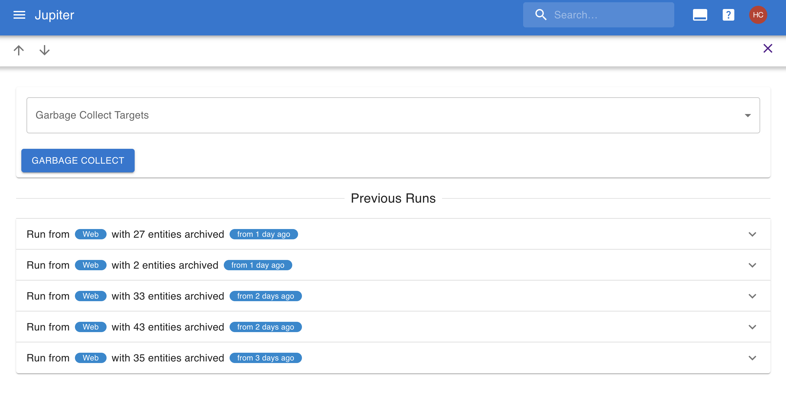

# Garbage Collection

Garbage collection is a periodic action that cleans up tasks and big plans that are
completed and otherwise lingering on in the system. It marks them
as _archived_, which means they won't appear in various views, or counted
in other processes like [task generation](./tasks-generation.md). But
they don't dissapear for ever, and will always be accessible.

It currently happens daily without any user intervention.

There is a log of all the runs, which shows you which entities were
archived too.

In the web app you can find reporting in the `Garbage Collect` left-hand side tab, under _tools_. It looks
something like this:

You can trigger a manual by pressing the `Garbage Collect` button.

The CLI command is called `gc` and has the same capabilities as the Web App.

The command is idempotent, so you can run it however many times you want and it'll do the right thing.
Furthermore it does not affect task status, or any extra edits on a particular instance of a task, besides
marking some entities as archived.
