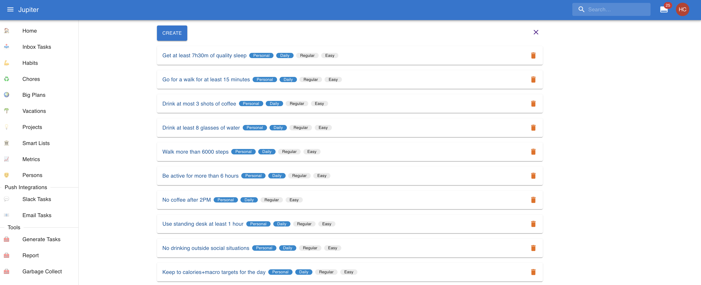
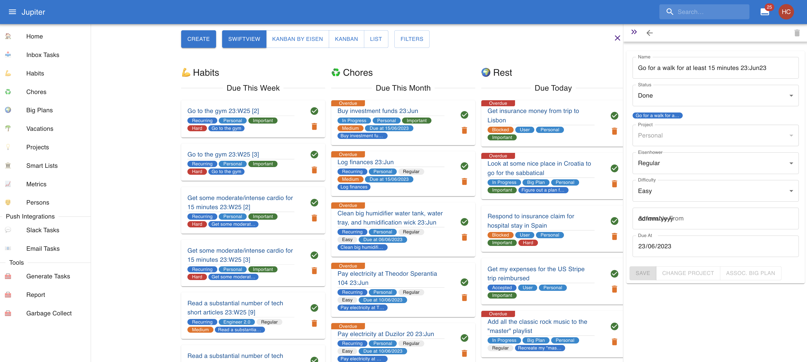

# Habits

A habit is a regular activity, usually one that is centered on _you_. Habits live in the
"habits" view, but they're instantiated as regular tasks in the "inbox".

For example, you can have a habit like "Walk more than 10000 steps every day" or
"Meditate for 5 minutes".

In the habits view, the task templates might look like this:

## Properties

Habits have a _period_ and a _period interval_. The former is set via the `period`
property and the latter is derived uniquely from this. The period can be one of:

* _Daily_: a task which needs to happen once a day. In a year there will be 365 or 366
  instances of such a task, and the period interval for each one will be each day. The
  intervals are numbered from 1 to 365.
* _Weekly_: a task which needs to happen once a week. In a year there will be 52
  instances of such a task, and the period interval for each one will be the corresponding
  week. The intervals are numbered from 1 to 52.
* _Monthly_: a task which needs to happen once a month. In a year there will be 12
  instances of such a task, and the period interval for each one will be the corresponding
  month. The intervals are numbered from 1 to 12.
* _Quarterly_: a task which needs to happen once a quarter (group of three months). In a
  year there will be 4 instances of such a task, and the period interval for each one will
  be a group of three consecutive months (Jan/Feb/Mar, Apr/May/Jun, Jul/Aug/Sep, and Oct/Nov/Dec).
  The intervals are numbered from 1 to 4.
* _Yearly_: a task which needs to happen once a year. In a year there will be 1 instance
  of such a task, and the period interval for it will be the full year. The intervals
  are numbered by the year.

Notice that the smallest period is the `daily` one, with a period interval of one day. In
general, for a given period interval there can be only one instantiation of a task of that
period.

While in the inbox, the instantiated tasks might look like this:}

The instantiated task in the inbox is constructed from the habit template, but
it also changes in the following way:

* The name contains the period interval for which the task is active. So "Meditate for 5 minutes"
  becomes "Meditate for 5 minutes Feb23". The formats are "Feb22" for daily periods,
  "W13" for weekly periods, "Mar" for monthly periods, "Q1" for quarterly periods,
  and "2020" for yearly periods.
* There is a link back to the owning habit.
* Most fields are not editable.

Habits can be marked as _key habits_. This is first a user-level concept - it marks
the habit as an important one for you, that is absolutely necessary to get right. In
various other contexts it applies, helping with sorting, prioritization, etc.

Habits can also have an actionable date. By default there is none, and the generated
inbox task won't have an actionable date. If you specify an `actionable_from_day` and/or
`actionable_from_month` properties, they will determine the inbox tasks to have one. They work like
so:

* For tasks with weekly and monthly periods, the `actionable_from_day` property can be set. This
  will set the actionable date to be that many days into the period interval.
* For tasks with quarterly and yearly periods, the `actionable_from_month` and `actionable_from_day`
  properties can be set. The first parameter will specify the month in the period interval to
  set the actionable date to. If `actionable_from_day` is not set, the first day of the month is
  used, otherwise the specified day is used.

Habits also have a deadline. By default the deadline is the end day of the period
interval, at midnight. You can override it however to specify, via the `due_at_day` and
`due_at_time` properties. They work like so:

* For tasks with daily period, only the `due_at_time` property can be set. For example
  `due_at_time: "17:00"` will mark a task as due at 5PM in the local timezone, as opposed
  to 11:59PM in the local timezone.
* For tasks with weekly and monthly periods, the `due_at_day` and `due_at_time` property
  can be set. For example `due_at_day: 10` will set the deadline of a monthly task
  to be the midnight of the 10th day of the month. Adding `due_at_time: "13:00"` will
  mark it as due at 1PM in the local timezone on the 10th day of the month.
* For tasks with quarterly and yearly periods, the `due_at_month`, `due_at_day` and
  `due_at_time` property can be set. For example `due_at_month: 3` will set the deadline
  of a yearly task to be the midnight of the last day of March. Adding `due_at_day: 10`
  will mark it as due at midnight of the 10th of March. and adding `due_at_time: "13:00"`
  will mark it as due at 1PM on the 10th of March.

Habits can be configured to skip certain periods via a skip rule. This is
specified via the `skip_rule` property, which can be one of:

Chores can be configured to skip certain periods via a skip rule. This is
specified via the `skip_rule` property, which can be one of:

* `odd`: keeps the odd numbered intervals for the period. For days
  this means every other day relative to the first day since Jan 1st 1970,
  for weeks and months and quarters things are relative to the year,
  and for years the year itself should be odd.
* `even`: keeps the even numbered intervals for the period. Same rules apply as above.
* `every n k`: keeps just one interval in a consecutive group of `n`.
  Then `k` determines which one. `every 3 1` means that the first interval
  in a group of three will be kept. `every 5 2` means that the second
  interval in a group of five will be kept.
* `custom_day_rel_weekly x y z ...`: keeps only certain days of the week.
  Applicable for daily chores.
* `custom_day_rel_monthly x y z ...`: keeps only certian days of the month.
  Applicable for daily chores.
* `custom_week_rel_yearly x y z ...`: keeps only certain weeks in the year.
  Applicable for weekly chores.
* `custom_month_rel_yearly x y z ...`: keeps only certain months in the
  year. Applicable for monthly chores.
* `custom_quarter_rel_yearlly x y z ...`: keeps only certain quarters
  in the year. Applicable for quarterly chores.

A habit can have a repeat count. This makes the task actually be generated multiple times
in a given time period. It's easier to model some habits - like reading 10 books in a year.

How tasks are generated is further controlled by a _repeat strategy_. This determines how
the repeats are spread out in the period. There are currently two optins:

* `All Same`: every task generated will have an actionable data that is the start of the
  particular period's interval, and an due date that is the end of the interval.
* `Spread Out No Overlap`: tasks will be placed in the interval in order such that the
  due date of one is the actionable date of the other, perfectly partinioning the period's
  interval. The number of days in the period must be larger than the repeat count. Even so
  there isn't a guarantee each one will receive the same number of days. For example, if
  for a weekly period and a repeat count of `4`, the generated tasks will each have
  `2`, `2`, `2`, and `1` days in duration respectively.

Repeat count and stragies are not available when the period is `daily`. And you of
course need to specify both one and the other, or neither.

A habit can be suspended, via the `Suspended` property. Being marked as such means
that the task won't be generated at all. For example, going to the gym might be suspended while
you're recovering from an illness.

A habit can also have a difficulty, just like a regular task. This will be copied
to all the instantiated tasks that are created.

Similarly, a habit can have the Eisenhower properties. These will be copied to
all the instantiated tasks that are created.

Habit inbox tasks are created via [task generation](tasks-generation.md).
