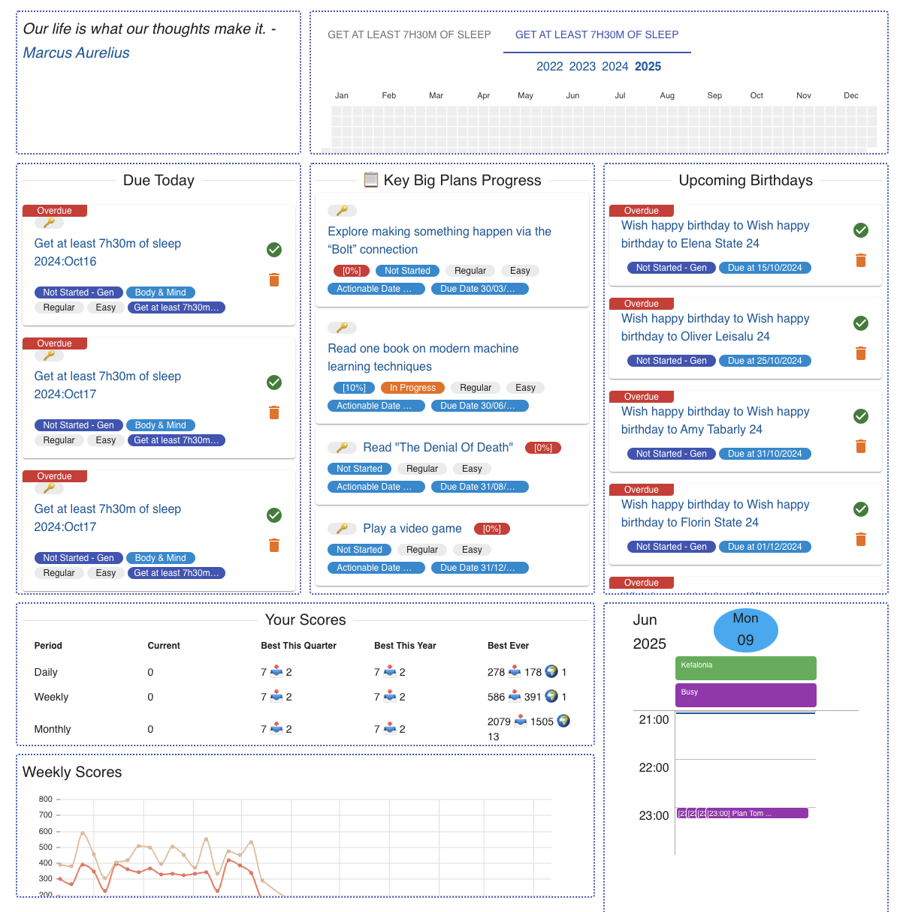
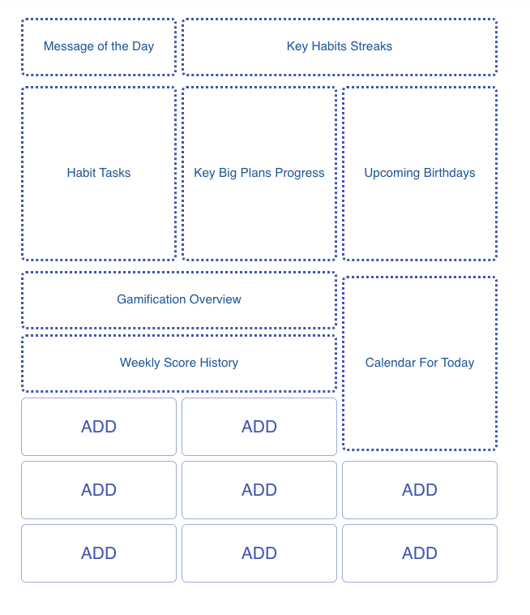

# Home Page

By default Thrive will start in the "home page". This is a part of the application
that allows a quick glance at very many aspects of your workspace.

Presently, the _home page_ consists of a number of _tabs_ that in turn comprise
of a number of _widgets_. You can configure both the _tabs_ and _widgets_ in them
in very many ways.

A typical example of a home page might look like:

The top-level things to define are _tabs_. You can have _big screen_ or
_small screen_ tabs, to account for the various ways of viewing information.

Within a tab you can add _widgets_. Big screen tabs have a grid-like
placement of `3` columns and many rows. Small screen tabs have a single
column-like placement with many rows.

There are many types of widgets, and more are constantly added. Some examples
are:

* Message of the day
* Overview of habit streaks
* Today's calendar or schedule
* Quick links to time plans
* A random chore to do
* And many more ...

Each widget you place has a certain position and occupies a certain size
in terms of cells in the grid. The widget type determines the size, with
each having several options, depending on the size of the screen.

Placed widgets can also have some configuration attached to them, such
as what and how to show. This allows for extra customisation, making
each placement of a widget unique.

Some sizes are marked as `kx1` or similar. These will spread to occupy
as much room as there is in the column/s that the widget takes. You cannot
place any other widgets underneath them.

This is only available in the [surfaces](clients.md) that have a large GUI
interface - the Web App, desktop apps, mobile apps, and PWAs.