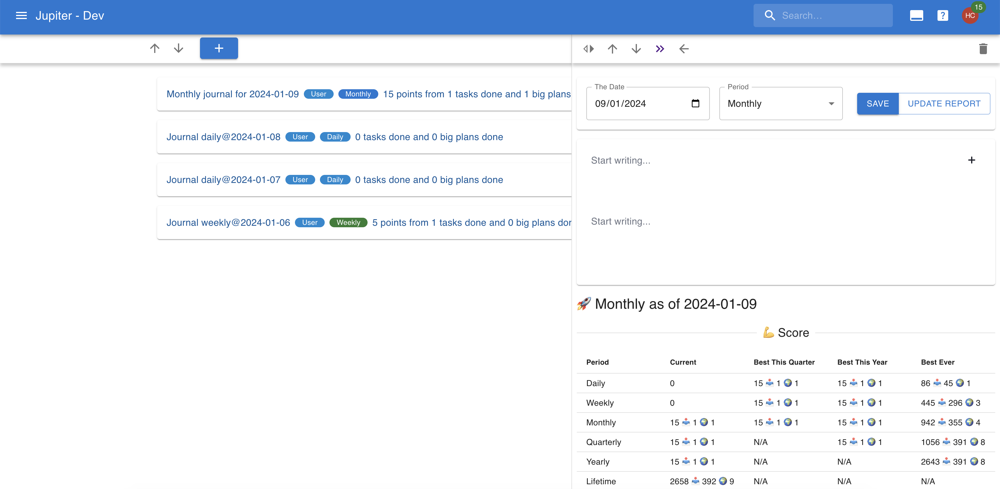

# Journals

A journal is a brief recounting of how a particular day, week, month, or other time period went.
Journals live in the "journals" view.

## Auto-Generation

Journals can be configured to be generated automatically, via the 
[task gen mechanism](tasks-generation.md). The mechanism is simple: a few
days in advance of the time period a journal would target, a new journal is
generated, with an optional journaling inbox task attached to it.

There are a number of settings you can control:
* The periods you are using for journaling. A typical scenario would be
  daily and weekly journals.
* Whether to generate journals and journaling tasks, just journals, or
  nothing at all.
* The eisenhower, difficulty, and [project](projects.md) to use for generating tasks.

Note that journals are always for a given period. The tasks associated with
them have a due date set to the end of the planning period, as you should
finish your journaling before the period end.

Also note that if there's a journal you created targeting that same
period and date combination, a new one _won't_ be generated.

## Properties

Journals are written on a particular _day_ for a particular _period interval_. The period can be one of:

* _Daily_: the day's journal
* _Weekly_: the week's journal, as recorded on the particular _day_.
* _Monthly_: the month's journal, as recorded on the particular _day_.
* _Quarterly_: the quarter's journal, as recorded on the particular _day_.
* _Yearly_: a whole year's journal, as recorded on the particular _day_.

Only one journal can exist for a particular _day_. Furthermore, a
single journal can exist for a particular _period_ in time (so you
better write the journal of that period towards the end of it).

Journals are mainly a written artifact, so they're essentially one big document.
But they do have a recording ot the work activity
that happened during that period (scores achieved, tasks done, etc),
much like in the [report functionality](reporting.md).
