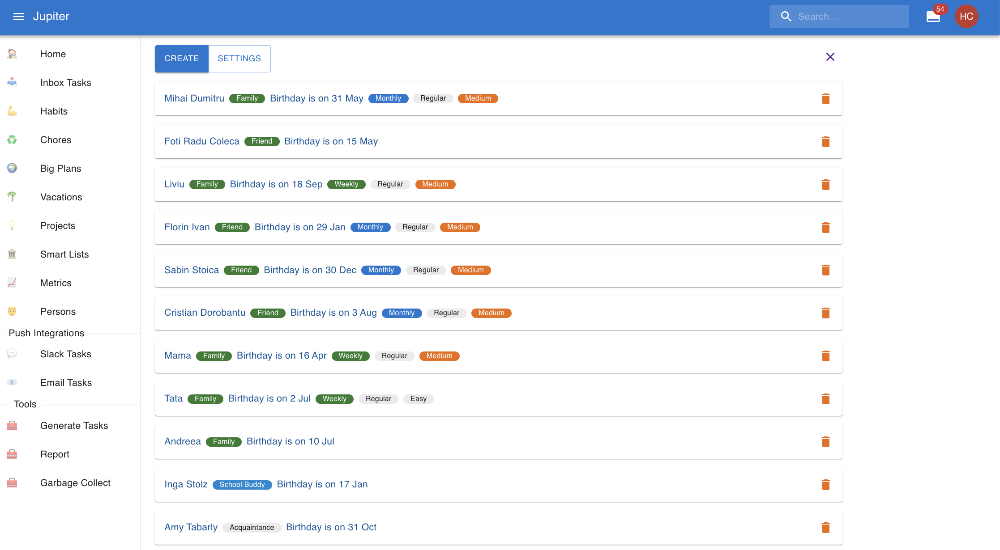
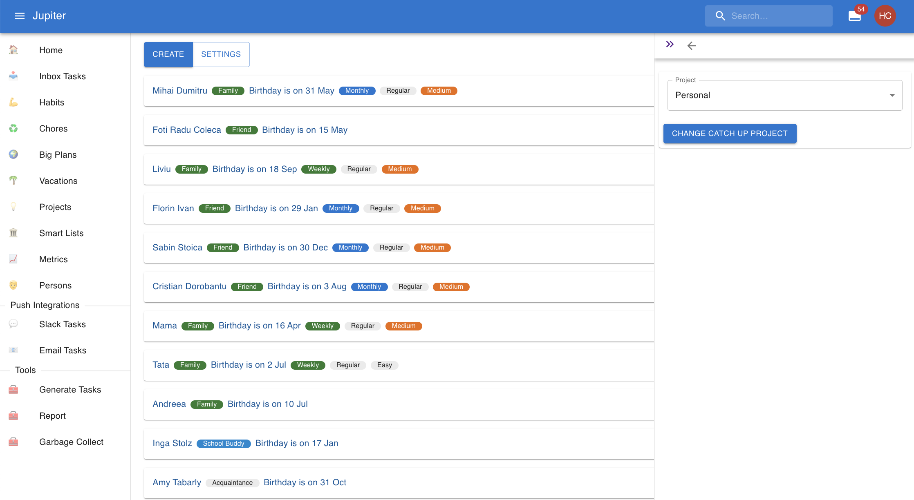

# Personal Relationship Manager

The personal relationship manager (PRM) is a database of people with which you wish to keep some
special contact. It's like a _customer relationship management_ system, but for the people in
your life.

It's first role is simply as a database of the persons you know. But via other Thrive mechanisms
it can make sure you don't forget about birthdays, or remember to catch up regularly, or even
call for specific holidays.

In the workspace, you can see the PRM:

## Properties

The PRM database contains people. But it has some metadata too.

Currently this is the catch up project - the project where birthday, catch up tasks, etc are
generated.

A person has a name, and it must be unique. Add some clarification next to it to resolve
conflicts.

A person also has a certain relationship with you - family, friend, work buddy, etc.

A person can have a defined _catch up period_. Some guideline for how often you should try to
catch up with them - a message, a call, or even a dinner would all count. Corresponding
inbox tasks are [generated](tasks-generation.md) in the PRM _catch up project_ much like
with [metrics collection](metrics.md).

* There are a number of other optional parameters which control how the catch up inbox task is
  setup, and they have the same meanings as for [habits](habits.md).
* If the period is missing, then no generation occurs, and the whole parameter set is ignored.

A person can have a birthday. It needs to be specified with the format like `12 Apr`. An
inbox task is defined yearly for this and also generated.

* If the birthday is missing, the no generation occurs.
* The birthday has an actionable date so it doesn't clog up the inbox. It becomes visible like:
  * `28` days in advance for family
  * `14` days in advance for friends
  * `2` days in advance for everyone else

## Person Settings

In the web app you can change the global catch up project via the `Settings` button:

