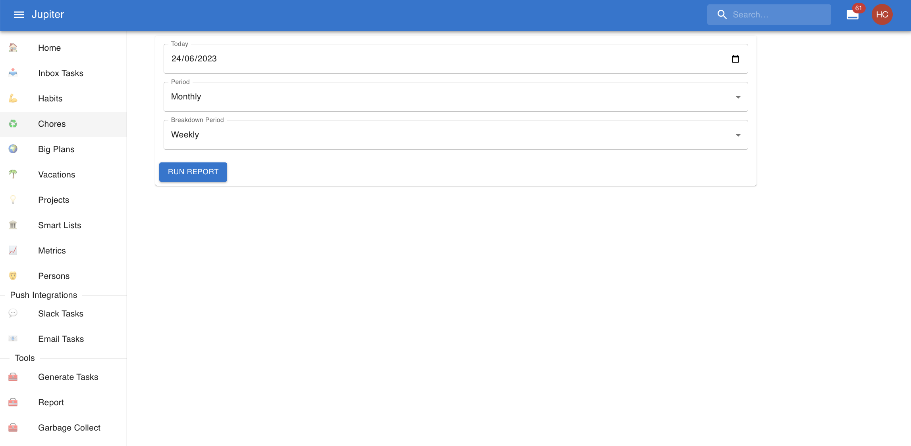
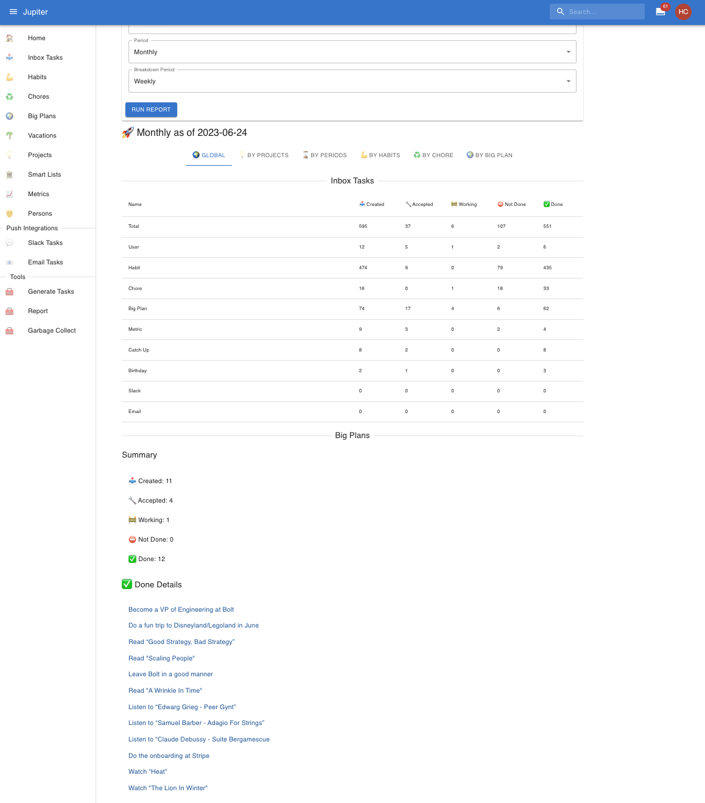
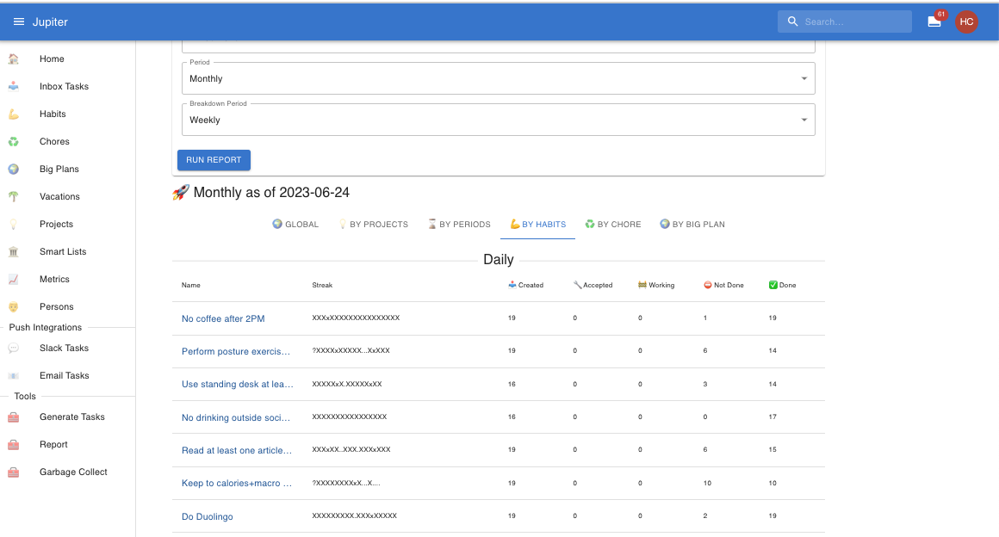

# Reporting

Reporting is currently the main tool for reflection on past achievements, good aspects, and weak spots.

In the web app you can find reporting in the `Reports` left-hand side tab, under _tools_. It looks
something like this:

You can select a time at which to run the report. By default it is the present day, but you can select
any day in the past (or the future).

You can also ask a time period to analyse - the last week, month, quarter, or year.

Finally you can ask for a time period to use for a breakdown analysis. This is always some time unit
smaller than the analysis period. Within the analysis period, each breakdown period will be analysed
in part.

The main result is called `Global` and shows you aggregate stats for the whole analysis period. It is
the most valuable view. It looks something like this:

A very useful view is the breakdown by habit, that shows streaks for each habit. It looks something
like this:

But there are other views:

* A breakdown by project which can highlight particularly good or bad projects.
* A breakdown by sub period
* A breakdown by big plans
* An analysis for chores, but without any streaks.

The CLI command is called `report` and has the same capabilities as the Web App.