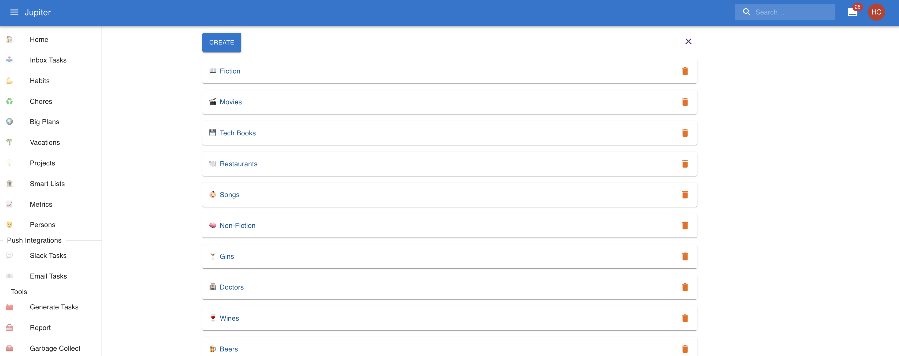
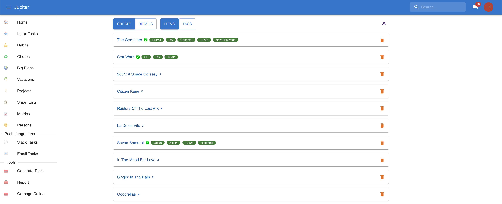

# Smart Lists

Smart lists are list for recording things! Organised people often keep lists. For example of
things they've done or plan to do. And they can be for anything: movies, books, courses,
songs, places, restaurants, etc. Lists are good for long term planning as they can allow
the construction of a plan outside of the formal constraints of [big plans](big-plans.md).

In the workspace overview, you can view the set of smart lists:

Smart list items are the actual books you want to read, movies you've seen, or courses you've attended.
They are attached to a particular smart list.

For example, you can have a smart list item like "The Godfather", or "Trafalgar Square", in your list of
movies, and places to visit, respectively.

Each smart list contains many items, for example:

## Properties

Smart lists have a name.

They also have an icon, which is a nice unicode glyph like 📖 or 🍺 which serves to visually
distinguish the smart list.

Smart list items have a name.

Smart list items also have a notion of doneness. Many many times lists are built in order to act somehow on
them - go to a place, read a book, etc. To support this out of the box, items can be marked as "done".

Smart list items also have tags. You can use them to classify them or to keep track of info you otherwise can't
right now (author, year of publication, etc).

Smart list items also have an optional url. It can be used to provide extra information about the particular item,
such as an Amazon link where it can be bought, or the actual link of the actual interesting article you want to
read.
