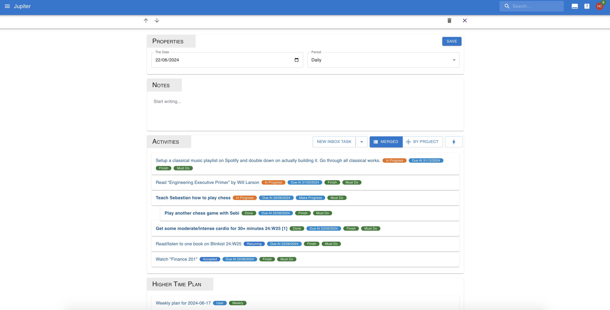

# Time Plans

Time plans are plans that you make for a particular time period. It is
a committment you make that in a certain period of time, you're going to
accomplish certain things. This is either making progress or finishing
altogether some [inbox tasks](./inbox-tasks.md) or [big plans](./big-plans.md).

While inbox tasks and big plans as they are capture the totality of the work
that you know of, and even assign due dates or active dates to them, time plans
make an explicit attempt at placing all this work in time, and committing to
it.

The association between an inbox task or big plan and a time plan, is called
an _activity_. A time plan can be said to be the collection of its activities.

Time plans are also closely linked with [journals](./journals.md). Whereas
journals are backward looking, time plans are forward looking.

## Properties

Time plans are written on a particular _day_ for a particular _period interval_.
The period can be one of:

* _Daily_: the day's plan
* _Weekly_: the week's plan, as recorded on the particular _day_.
* _Monthly_: the month's plan, as recorded on the particular _day_.
* _Quarterly_: the quarter's plan, as recorded on the particular _day_.
* _Yearly_: a whole year's plan, as recorded on the particular _day_.

Only one journal can exist for a particular day and period combination.

Time plans also have a written document attached to them, so you can add
thoughts that don't fit as neatly into the activities format.

An activity has a _target_, which is either an inbox task or a big plan.

Activities also have a _kind_, which can be:

* _Finish_: you plan on finishing this activity during the period.
* _Make Progress_: you plan on making progress during the period.

Activities also have a _feasability_, which can be:

* _Must Do_: it is very important that you make the required progress on the
  activity during the period.
* _Nice To Have_: if you can make progress, it's good, if not, no worries.
* _Stretch_: very unlikely to make progress.

Finally activities have a measure of _doneness_ withing the time plan.
This is not something that can be judged at the level of a single activity,
but requires looking at the whole thing.

* Inbox tasks of a _finish kind_ are considered done if they are in either the
  _done_ or _not done_ status, and this occurred during the time plan's period.
* Inbox tasks of a _make progress kind_ are considered done if there is some
  modification of the inbox tasks during the time plan's period.
* Big plans of a _finish kind_ are considered done if they are in either the
  _done_ or _not done_ status, and this ocurred during the time plan's period.
* Big plans of a _make progress kind_ are considered done if all the inbox tasks
  associated with it in the time plan are considered done, or if there are no
  such tasks if there is some modification done during the time plan's period.
