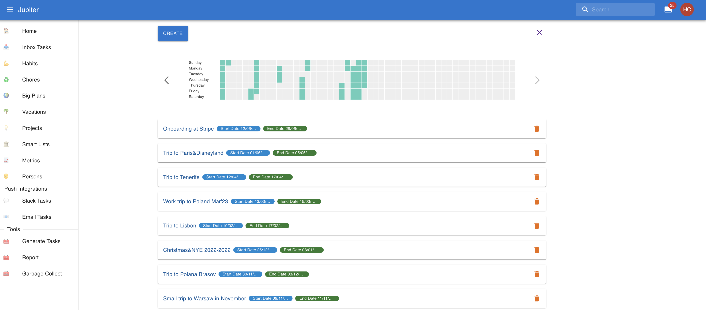

# Vacations

A _vacation_ is a set period of time when some scheduled tasks aren't scheduled. These are
essentially chores that do not have the _must do_ attribute set.

Vacations are attached to the workspace. You can see the vacations in
the `Vacations` left-hand menu tab. An example:

Alternatively you can see vacations via `vacation-show` in the CLI.

## Vacations Properties

A vacation has a name.

The start date is the time when the vacation starts, and tasks should not be generated. It should be before the
end date.

The end date is the time when the vacation end, and tasks should again be generated. It should be after the
start date.
