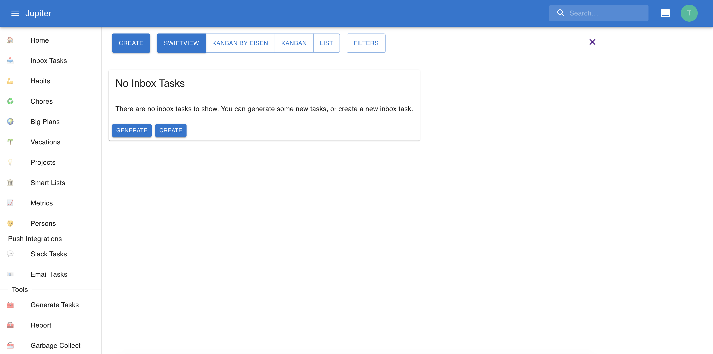

# Workspace

All the work for life planning takes place in a _workspace_. When you create a new
account in the web app or call `thrive init` in the CLI app you are creating
a new workspace.

Right now, a single account can have just one workspace, that is private to the user.

All further concepts we discuss are _relative_ to the workspace.

After creating a workspace, you’ll see something like the following, depending on the feature flags selected:

## Properties

A workspace has a _name_.

A workspace also has a notion of _default project_. Checkout [the projects section](./projects.md) for more details
about projects. But in context where a project is needed - say when adding a new inbox task, or generating an
inbox task from a metric - and none is specified, this one will be used instead.

[Feature flags](feature-flags.md) are also associated with a workspace.
