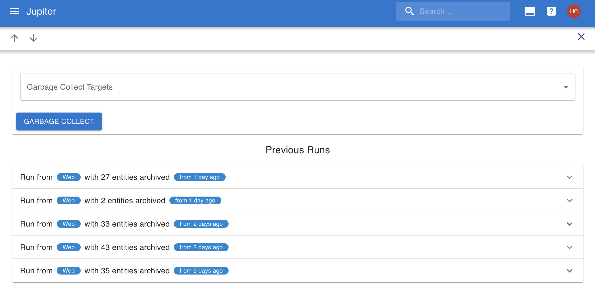

# Do Garbage Collection

As you work in your workspace, you'll make quick work of your tasks. These will gather in your "done" and
"not done" columns and start to lose their relevance.

These takss and big plans are periodically [garbage collected](../concepts/garbage-collection.md) by the system.

If you need to do it faster than what the system does, you can _garbage collect_ them manually.

In both cases this will _archive_ the completed tasks
and big plans. You will still be able to access them, but they won't appear in the inbox task view.

## With The Web App

In order to perform garbage collection in the webapp you need to go to the "Garbage Collect" left-hand side menu
item and click "Garbage Collect".



## With the CLI App

The same thing can be achieved with the  `gc` command of the CLI, like so:

```bash
$ thrive gc
```