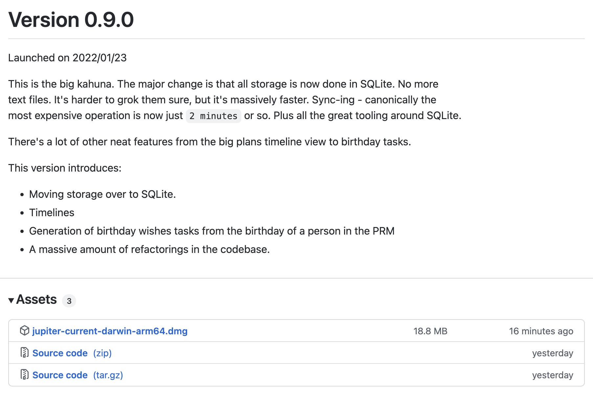

# Installation

## Web Application

The simplest way to use Thrive is by using the [web application](https://get-thriving.com/).
If this is the first time you're visiting you'll be prompted to create an account.

By using the web application you will be running in
[global hosted mode](../concepts/hosting-options.md). You can access the web app in self hosted mode too.

## Desktop App, Mobile Apps, PWA

You can download the desktop app, mobile apps, or install a PWA for desktop (MacOS) and
mobile (iOS and Android) too.

## MacOS Dmg Local

For MacOS, a simple way of installing the Thrive CLI is via a `dmg` archive published
together with a release. You can check them
[in the release page](https://github.com/horia141/thrive/releases).



You can then download and install it into your `Applications` folder by dragging and dropping it
like any other application.

Invoking this is a bit tricky however:

```bash
$ mkdir my-thrive-work-dir # A dir where you manage local Thrive data.
$ cd my-thrive-work-dir
$ /Applications/Thrive.app/Contents/MacOS/thrive init --help
```

You can of course add an alias to your shell about it.

By using this approach you will be running in [local mode](../concepts/hosting-options.md).

## Self-Hosting

If you want to run Thrive in self hosted mode, check out the [self hosting guide](self-hosting.md).
