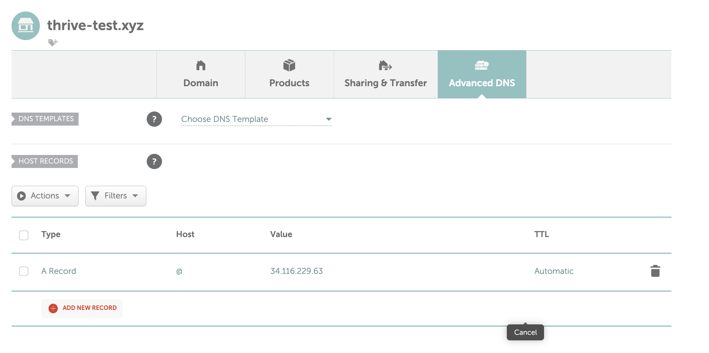
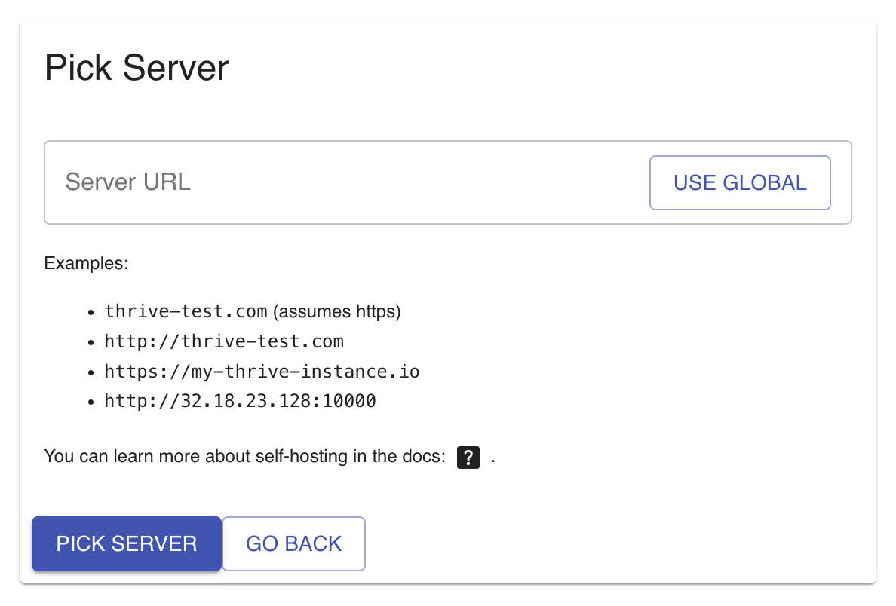

# Self-Hosting

> This is a work in progress section on how to do self-hosting for Thrive.

Thrive natively support self-hosting, though at this moment only via the webapp, PWA, and
desktop app surfaces. This document presents a number of alternative ways to achieve this.

**Self-hosting** means you are running the Thrive application on your _own infrastructure and
servers_ rather than using the [hosted version](https://get-thriving.com). This gives you full
control over your data and the application, but requires managing the deployment
and maintenance yourself.

We've tried making the experience as smooth as possible, but realistically self-hosting
requires a modicum of tech knowledge. Even if you manage to follow the instructions
below, there are aspects of reliability, data recovery, security, etc. that are tricky to get right. 
If you're unsure, the [hosted version](https://get-thriving.com) aims to be respectful
of you and focused on privacy.

## With A Linux VPS Via Docker (Hetzner, DigitalOcean, etc)

There's many ways to self-host Thrive, but running it on a Linux VPS via Docker is both
general and flexibile. And also sufficiently high-level that even folks that are not
software developers can follow along.

### Groundwork

Before we properly begin, there are a couple of steps you need to take: getting
a VPS, getting and configuring a domain, getting a certificate for the domain, and installing Docker.

If you're actively self hosting other projects, you probably have some
setup already done, so you just need to adapt the following to your
situation. If you've self-hosted before, but not anymore, or even if you've
never done it, the setup should be straight-forward.

#### VPS

A VPS (Virtual Private Server) is a virtualized server that you can rent from a
cloud provider. It runs on their hardware but gives you full control over the
operating system and software, just like having your own dedicated server.
Popular VPS providers include [Hetzner](https://www.hetzner.com/), [DigitalOcean](https://www.digitalocean.com/), [Linode](https://www.linode.com/), and [Vultr](https://www.vultr.com/).

For running Thrive, a basic VPS with 1-2 GB RAM and 1 CPU core should be sufficient
for personal use. The providers above all offer plans starting around $5-10/month.

> The big cloud providers like AWS, GCP or Azure have similar offerings (and much
> more), but they tend to require a more involved setup and have slightly higher
> prices for what we'd need.

Each provider has their own way of setting things up, but it should be
fairly straightforward to buy a VPS and get SSH and root access to it.

#### Docker

You'll also need Docker installed on your VPS. Docker is a platform for running
applications in containers - lightweight, isolated environments that package up
all the dependencies needed to run the software. Most VPS providers offer images
with Docker pre-installed, but if not, you can follow the
[official Docker installation guide](https://docs.docker.com/engine/install/)
for your Linux distribution.

#### A Domain [Optional]

Your VPS will typically be accessible via an [IP Address](https://en.wikipedia.org/wiki/IP_address)
such as `32.114.15.21`. You'll probably want a domain like `my-thrive-instance.com`
so accessing your instance is simpler and more secure (because we'll also get a
certificate for it).

So instead of going to something like `http://32.114.15.21` to work, you can 
visit to a much nicer `https://my-thrive-instance.com`.

The standard setup for Thrive requires a domain and a certificate, but it also
offers a way of running things without them. Also, if you've already got a VPN
and have setup a domain for it, you can adopt to steps to easily make it work
with them.

You can get a domain from registrars like [Namecheap](https://www.namecheap.com/), [GoDaddy](https://www.godaddy.com/), or [Google Domains](https://domains.google/). Most domains cost around $10-15 per year, but
you can find ones for as low as $2 per year. 

After purchasing, you'll need to point your domain to your VPS by creating an `A record` in
your domain's DNS settings that points to your VPS's IP address. This might look
something like this:



#### Certificate via LetsEncrypt's Certbot [Optional]

The most common way nowadays to get and use an HTTPs certificate is via
[Let's Encrypt](https://letsencrypt.org/). And [certbot](https://certbot.eff.org/)
is _the_ tool for actually obtaining and managing the certificate.

It's instructive to read about the effort, the concepts, and tools. But
in truth, you just need to look at the instructions from [other and pip](https://certbot.eff.org/instructions?ws=other&os=pip&tab=standard).

At some point in that tutorial, you're going to run:

```bash
sudo certbot certonly --standalone
```

Which will ask you about the domain name you wish to obtain the certificate
for. Enter your domain (say `my-thrive-instance.com`) and, if you've configured
the DNS settings correctly, you'll get two new files in:

```
/etc/letsencrypt/live/my-thrive-instance.com/fullchain.pem
/etc/letsencrypt/live/my-thrive-instance.com/privkey.pem
```

Don't forget to setup auto renewal from the instructions! Otherwise the
certificate _will expire in 90 days_. This is a low lifespan by design,
to force folks to be _on top of_ domain renewals!

### Preparation

With the groundwork out of the way, we can actually do something that
is specific to Thrive. 

First, you need to download some configuration files to
your machine. Putting these files in your home directory should be enough:

```bash
wget https://github.com/horia141/jupiter/releases/latest/download/compose.yaml
wget https://github.com/horia141/jupiter/releases/latest/download/nginx.conf
wget https://github.com/horia141/jupiter/releases/latest/download/webui.conf
wget https://github.com/horia141/jupiter/releases/latest/download/webui.nodomain.conf
```

It's instructive to inspect them, and you are free to modify them, but
there should not be any need.

There is some configuration that's specific to your instance of Thrive that
you'll need to provide though. You'll need to create and edit an `.env` file like so:

```bash
touch .env
echo "NAME=Horia's Thrive" >> .env # Use your own name here
echo "DOMAIN=my-thrive-instance.com" >> .env # Use your own value here
echo "AUTH_TOKEN_SECRET=$(openssl rand -base64 32)" >> .env
echo "SESSION_COOKIE_SECRET=$(openssl rand -base64 32)" >> .env
```

When inspecting the `.env` file, it should look something like this:

```bash
NAME=Horia's Thrive
DOMAIN=my-thrive-instance.com
AUTH_TOKEN_SECRET=s6cfvG3E3vyzXjtIM/1I6+t9oM9pGBC6GG0O9L7XmiY=
SESSION_COOKIE_SECRET=FI3X/vjPJCUUeH+tu2OvhCQn7i1HyiVV2Vl4g/ce9DQ=
```

To check that `docker` has picked up the config and is correctly integrating
it, run `docker compose config` and check that no errors are reported.

#### Running Without The Domain [Optional]

If you don't want to use a domain, you can just not provide the `DOMAIN`
environment value, but also edit `ngnix.conf` and replace `webui.conf`
with `webui.nodomain.conf` - a one word change!

### Running Things

If you're using a Linux distribution that uses `systemd` (which most should be these days), you need to enable docker as a startup service like so:

```bash
sudo systemctl enable docker
```

Now, you just need to run things via

```bash
sudo docker compose up -d
docker compose logs -f
```

You'll then see some output like:

```bash
[+] Running 3/3
... docker setting things up!
Attaching to frontend-1, webapi-1, webui-1
... output omitted
webui-1     | ================================================================================
webui-1     | Starting Jupiter WebUI:
webui-1     |   Version: 1.1.4
webui-1     |   Environment: production
webui-1     |   Hosting: self-hosted
webui-1     | ================================================================================
... output omitted
webapi-1    | ================================================================================
webapi-1    | Starting Jupiter WebAPI:
webapi-1    |   Version: 1.1.4
webapi-1    |   Environment: production
webapi-1    |   Hosting: self-hosted
webapi-1    | ================================================================================
... output omitted
webapi-1    | 2025-03-09 16:17:03 INFO     Uvicorn running on http://0.0.0.0:2000 (Press CTRL+C to quit)
... output omitted
webui-1     | Remix App Server started at http://localhost:2000 (http://0.0.0.0:2000)
```

This signals that the services making up Thrive are running and healthy.
It should take less than a minute to get to this output. If there's any errors,
you're free to debug them, or reach out on our channels
(GitHub issues, Discord,etc) for help.

### Testing & Surfaces

You can now access thrive by visiting the IP address or domain associated with your VPS.

Currently only the webapp, desktop app, and PWA are supported ways of interacting with your
self hosted version.

Whereas the webapp and PWA have a straightforward interactin pattern - visit your domain
and access the app, and optionally install the PWA that is specific to this particular
instance - the desktop app is designed to work with multiple hosts as a unit.

When you open it, you'll see an option to pick a server on the login or init screen,
which will take you to something like this:



You can enter the URL of your server (typically `https://your-domain.com`) and the app
will reconfigure to speak with it instead of the global hosted server. You can always
come back to the global one, or switch between several instances.

### Backups

WIP

### Reliability

The current setup will be resilient against machine restarts, service failures, etc. With a typical dedicated server or VPS setup this should get you to a cool `3 nines` of availability (or ±8 hours a year of downtime). For self-hosting this should be more than enough.

For any higher level of availability, you'll need to find a provider that offers machines with a higher availability SLA. At this point, the typical high-availabilty toolbox of multiple machines, replicated storage, etc. is not available for the self-hosted version.

### Updating

To to a newer version of Thrive, run the following command:

```bash
docker compose pull
```

If there's new Docker images they will be pulled. You can then restart the Thrive instance via:

```bash
sudo docker compose down
sudo docker compose up -d
sudo docker compose logs -f
```

Thrive is built in such a way that it will ensure there's a smooth update, and all components are updated and made compatible with the new version.

## With A High-Level Hosting Service (Render, Vercel, Genezio, etc.)

WIP

## More Alternatives

Thrive is developed on MacOS with a suite of relatively cross-platform technologies,
and the hosted service runs on [render.com](https://render.com). If you need more
than the VPS setup, it's probably doable, but requires a bit of extra elbow
grease. Contact us and we'll get it sorted.
